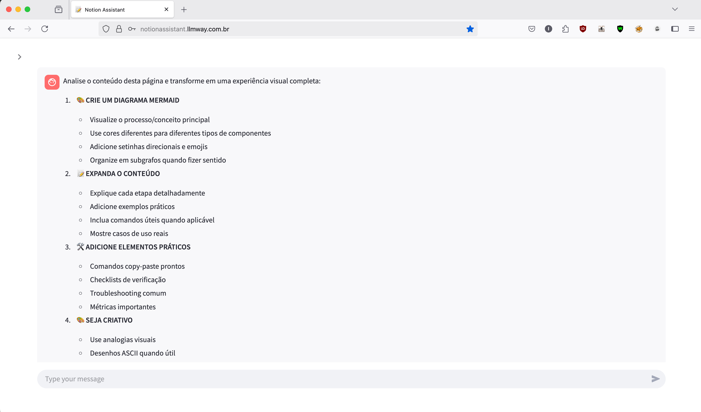
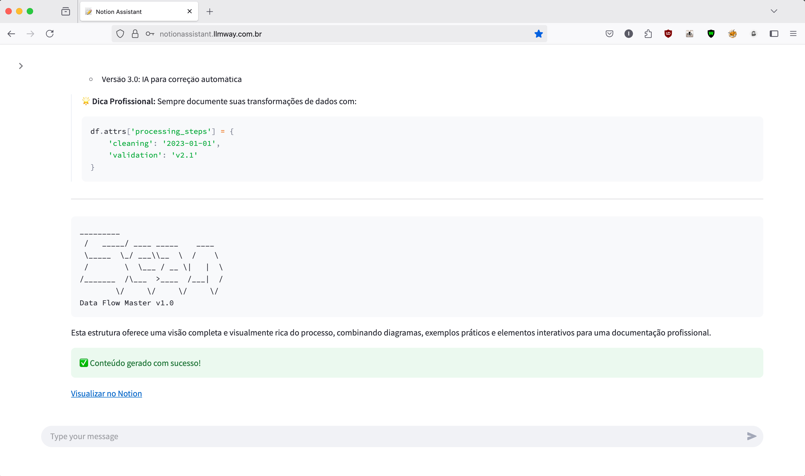
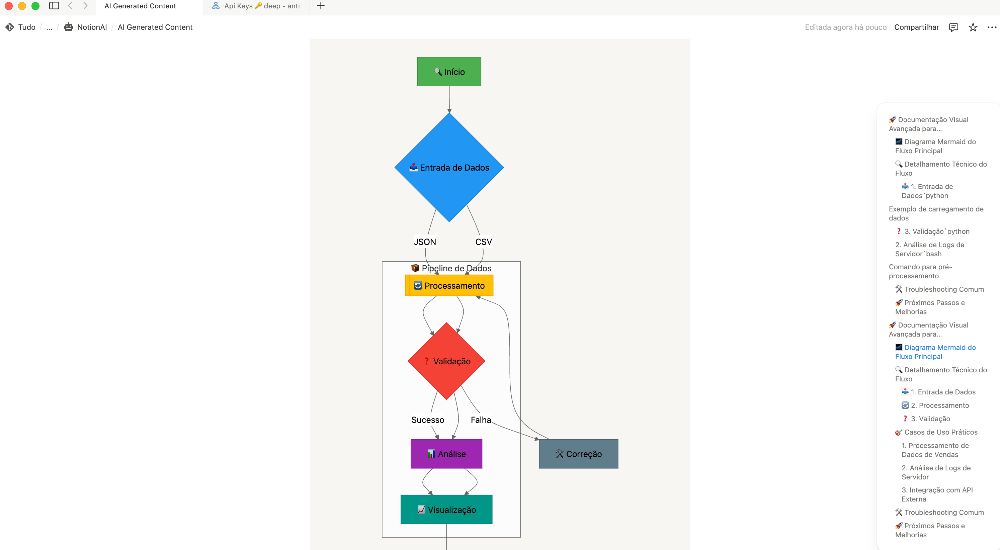
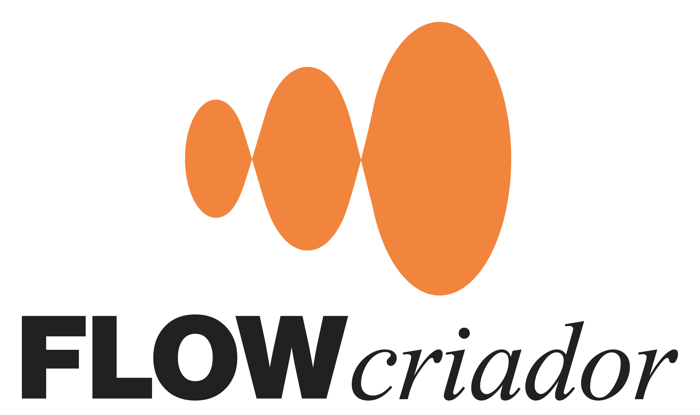

[🇺🇸 English](./README.md)

<div align="center">
  <!-- <br> -->
  
  <br/>
  <br/>
  <p>
    <strong>Assistente de Inteligência Artificial para o Notion</strong>
  </p>
  <p>
    <a href="https://notionassistant.llmway.com.br">Demo Online</a> •
    <a href="#-início-rápido-em-3-passos">Iniciar em 3 Passos</a> •
    <a href="./docs-public/pt-br/03-contribuicao/00-como-contribuir.md">Contribuir</a> •
    <a href="https://docs.notionassistant.llmway.com.br/">Documentação</a>
  </p>
  <p>
    
    
    
    <a href="https://buymeacoffee.com/igorrozalem"></a>
  </p>
</div>

## 🧠 O que é o  Notion Assistant?

 Notion Assistant é uma aplicação open-source que integra modelos de linguagem avançados (LLMs) com o Notion, permitindo que você:

- 🤖 Consulte e receba respostas inteligentes sobre seu conteúdo do Notion
- 📝 Gere textos, resumos e ideias diretamente no Notion
- 🔍 Pesquise em suas páginas com entendimento semântico
- 📊 Organize e estruture informações de forma automática

## 🚀 Início Rápido em 3 Passos

<br>

### 1️⃣ Clone o repositório

```bash
# Clone o repositório
git clone https://github.com/igorhlr/NotionAiAssistant.git
cd NotionAiAssistant
```

### 2️⃣ Configure o caminho de dados (opcional)

```bash
# Edite o arquivo de configuração com seu editor preferido
nano config/local-env.conf

# Adicione seu caminho personalizado (exemplo para macOS):
DOCKER_DATA_PATH=/Users/seuusuario/Documents/Projetos/NotionAiAssistant
```

### 3️⃣ Inicie com o script automatizado

```bash
# Dê permissão de execução ao script
chmod +x scripts/automated-deploy-dev.sh

# Execute o script de deploy automatizado
./scripts/automated-deploy-dev.sh
```

**E pronto!** 🎉 A aplicação estará disponível em:
- 🌐 **Frontend:** http://localhost:8501
- 🔌 **API:** http://localhost:8080

O sistema oferece **hot reload** - suas alterações no código serão aplicadas automaticamente!

## 🛠️ Configurações Adicionais

### Portas personalizadas

```bash
# Formato: ./scripts/automated-deploy-dev.sh [limpar] [rotacionar_secrets] [porta_frontend] [porta_api]
./scripts/automated-deploy-dev.sh false false 3000 8080
```

### Forçar limpeza completa

```bash
# Inicia com limpeza completa do ambiente
./scripts/automated-deploy-dev.sh true
```

### Usando Makefile (alternativa)

```bash
# Inicia ambiente de desenvolvimento
make dev

# Inicia ambiente limpo
make dev-clean

# Exibe todos os comandos disponíveis
make help
```

## 🔧 Configuração do Caminho de Dados Docker

O NotionAiAssistant armazena seus dados em volumes Docker para garantir persistência. Você pode personalizar facilmente o local onde esses dados serão armazenados:

### Exemplos de Configuração

- **macOS**: `DOCKER_DATA_PATH=/Users/seuusuario/Documents/Projetos/NotionAiAssistant`
- **Linux**: `DOCKER_DATA_PATH=/home/seuusuario/projetos/NotionAiAssistant`
- **Windows (WSL)**: `DOCKER_DATA_PATH=/mnt/c/Users/seuusuario/Documents/Projetos/NotionAiAssistant`

O sistema criará automaticamente a estrutura de diretórios necessária dentro do caminho definido.

## 🌟 Funcionalidades

- **Integração com Notion**: Conecte-se diretamente à sua conta do Notion
- **Assistente IA**: Interaja com o assistente para consultas e tarefas no Notion
- **Múltiplos Modelos**: Escolha entre diferentes modelos de LLM para suas necessidades
- **Histórico de Interações**: Acompanhe e retome conversas anteriores
- **Personalização**: Adapte o assistente às suas necessidades específicas

## 🛠️ Tecnologias

- **Frontend**: Streamlit
- **Backend**: FastAPI, Python 3.10+
- **Banco de Dados**: PostgreSQL 15
- **Infraestrutura**: Docker, Traefik, CI/CD automatizado
- **Integrações**: Notion API, APIs de LLM (OpenAI, Anthropic, DeepSeek)

## 📊 Screenshots

<div align="left">
  <p>Tela inicial com guia de uso, como obter as keys, page id e configuraçoes.</p>
  
  <br>
  <br>
   <p>Tela mostrando a realização de um prompt para analisar nossa pagina e recria-la de forma criativa e melhorar.</p>
  
  <br>
  <br>
   <p>Resultado na tela redirecionando para a pagina do notion criada.</p>
   
  <br>
  <br>
   <p>Pagina aberta no notion para verificar resultado, esse foi um dos graficos gerados no conteudo, o resto está estruturado ali a direita.</p>
  

</div>

## ❓ Solução de Problemas Comuns

| Problema | Solução |
|----------|---------|
| **"Containers não iniciam"** | Verifique se o Docker está rodando: `docker ps` |
| **"Erro de permissão"** | Execute: `chmod -R 755 ./config/secrets` |
| **"Portas já em uso"** | Altere as portas: `./scripts/automated-deploy-dev.sh false false 3001 8081` |
| **"Não consigo acessar a aplicação"** | Verifique se os containers estão rodando: `docker ps \| grep notionia` |
| **"Como ver os logs?"** | Execute: `docker logs notionia_dev_app` |

## 🤝 Como Contribuir

Contribuições são bem-vindas! Para contribuir:

1. Leia nosso [Guia de Contribuição](./docs-public/pt-br/03-contribuicao/00-como-contribuir.md)
2. Configure o ambiente seguindo as instruções acima
3. Explore as [issues abertas](https://github.com/igorhlr/NotionAiAssistant/issues)
4. Envie um pull request seguindo as diretrizes

## 📄 Documentação Completa

Para informações mais detalhadas, consulte nossa documentação completa:

### 📚 Links de Documentação

- [**Mapas do Projeto**](./docs-public/pt-br/00-mapas/): Visualize a estrutura e arquitetura
  -  [Visão Geral do Front](./docs-public/pt-br/00-mapas/00-front.md)
  -  [Aplicação Completa](./docs-public/pt-br/00-mapas/01-appCompleto.md)

- [**Como Executar**](./docs-public/pt-br/01-como-executar/): Instruções detalhadas de instalação
  -  [Configurando o Ambiente](./docs-public/pt-br/01-como-executar/00-configurando-ambiente.md)
  -  [Docker Compose](./docs-public/pt-br/01-como-executar/01-docker-compose.md)
  -  [Desenvolvimento com Hot Reload](./docs-public/pt-br/01-como-executar/02-desenvolvimento-hotreload.md)
  -  [Gerenciamento de Secrets](./docs-public/pt-br/01-como-executar/03-secrets-management.md)
  -  [Configuração do Docker Data Path](./docs-public/pt-br/01-como-executar/04-configuracao-docker-data-path.md)

- [**Arquitetura**](./docs-public/pt-br/02-arquitetura/): Detalhes técnicos da implementação
  -  [Visão Geral](./docs-public/pt-br/02-arquitetura/00-visao-geral.md)
  -  [Frontend](./docs-public/pt-br/02-arquitetura/01-frontend.md)
  -  [Backend](./docs-public/pt-br/02-arquitetura/02-backend.md)
  -  [Banco de Dados](./docs-public/pt-br/02-arquitetura/03-banco-dados.md)

- [**Como Contribuir**](./docs-public/pt-br/03-contribuicao/): Guias para contribuição
  -  [Como Contribuir](./docs-public/pt-br/03-contribuicao/00-como-contribuir.md)
  -  [Padrões de Código](./docs-public/pt-br/03-contribuicao/01-padroes-codigo.md)
  -  [Fluxo de PR](./docs-public/pt-br/03-contribuicao/02-fluxo-pr.md)

- [**CI/CD**](./docs-public/pt-br/04-ci-cd/): Visão educacional sobre integração e entrega contínua
  -  [Visão Geral](./docs-public/pt-br/04-ci-cd/00-visao-geral.md)

## 💖 Apoie o Projeto

Se você achou este projeto útil e gostaria de apoiar seu desenvolvimento contínuo, considere comprar um café para o desenvolvedor:

<div align="center">
  <!-- <a href="https://buymeacoffee.com/igorrozalem" target="_blank">
    
  </a> -->
<a href="https://buymeacoffee.com/igorrozalem" target="_blank"></a>

<br>
  <a href="https://buymeacoffee.com/igorrozalem" target="_blank">
    
  </a>
</div>
<br>

Seu apoio ajuda a manter o projeto atualizado e a adicionar novas funcionalidades!

## 📝 Licença

Este projeto está licenciado sob a [Licença MIT](./LICENSE).

## 🙏 Agradecimentos

### Agradecimento Especial ao:

<div align="center">
  <a href="https://flowcriador.com" target="_blank">
    
  </a>
</div>
<br>

A metodologia do [FlowCriador](https://flowcriador.com) foi fundamental no desenvolvimento deste projeto, ajudando a:

- **Coletar** e organizar informações de forma estruturada no Notion
- **Combinar** diferentes ideias para gerar soluções inovadoras
- **Criar** implementações concretas com maior eficiência

### Como o FlowCriador nos Ajudou

A abordagem do FlowCriador nos permitiu:
- Manter o foco nos objetivos principais do projeto
- Organizar o desenvolvimento de forma sistemática
- Adaptar rapidamente a novas necessidades e feedback
- Priorizar funcionalidades com base em valor real para os usuários

### Comunidade Open-Source

Este projeto se beneficia de inúmeras ferramentas e bibliotecas desenvolvidas pela comunidade open-source:

- **Python Community**: Por criar e manter uma linguagem poderosa e acessível
- **FastAPI Team**: Por desenvolver um framework que combina desempenho e facilidade de uso
- **Streamlit Team**: Por fornecer ferramentas que simplificam a criação de interfaces
- **Docker Community**: Por revolucionar a forma como desenvolvemos e implantamos aplicações
- **PostgreSQL Community**: Por manter um dos bancos de dados mais robustos e confiáveis
- **Notion Team**: Por criar uma API que possibilita integrações poderosas
- **GitHub**: Por fornecer ferramentas que facilitam a colaboração e o desenvolvimento open-source

---

<div align="center">
  <h3>Criado por Igor Rozalem</h3>
  <a href="https://github.com/igorhlr"></a>
  <a href="https://www.linkedin.com/in/igor-rozalem-a67560209/"></a>
  <a href="https://buymeacoffee.com/igorrozalem"></a>
  <br/><br/>
  <p>
    <a href="https://notionassistant.llmway.com.br">📱 Aplicação Web</a> •
    <a href="https://docs.notionassistant.llmway.com.br">📚 Documentação</a> •
    <a href="https://github.com/igorhlr/NotionAiAssistant/issues">🐛 Reportar Bug</a> •
    <a href="https://github.com/igorhlr/NotionAiAssistant/issues">💡 Sugerir Recurso</a>
  </p>
  <p><em>"A melhor maneira de prever o futuro é criá-lo."</em></p>
</div>