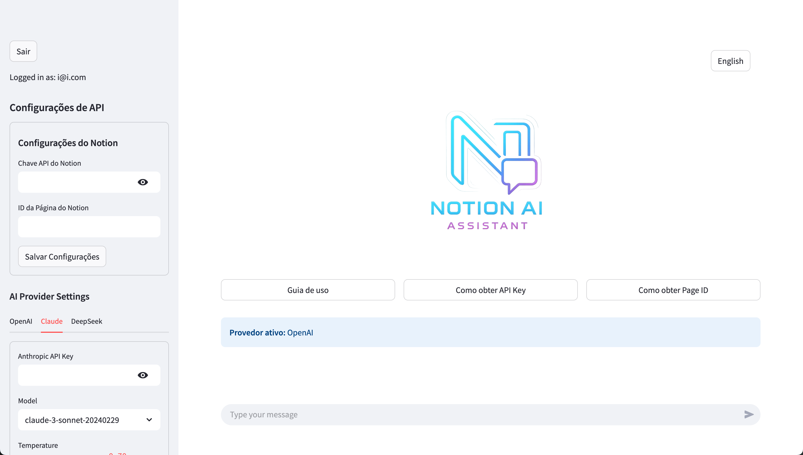
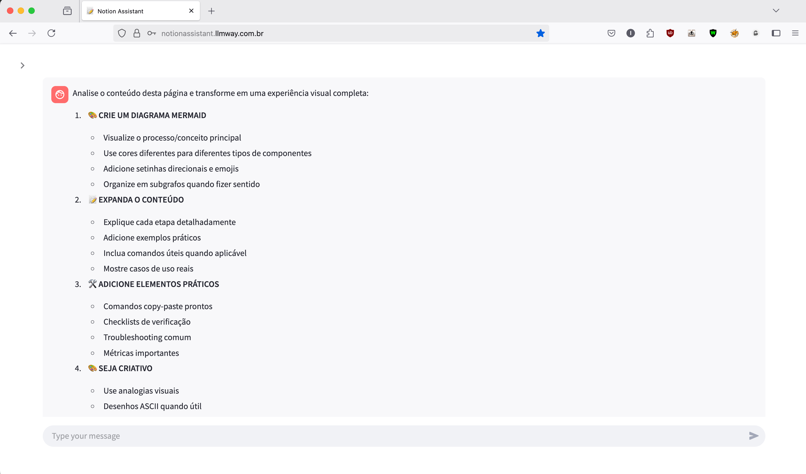
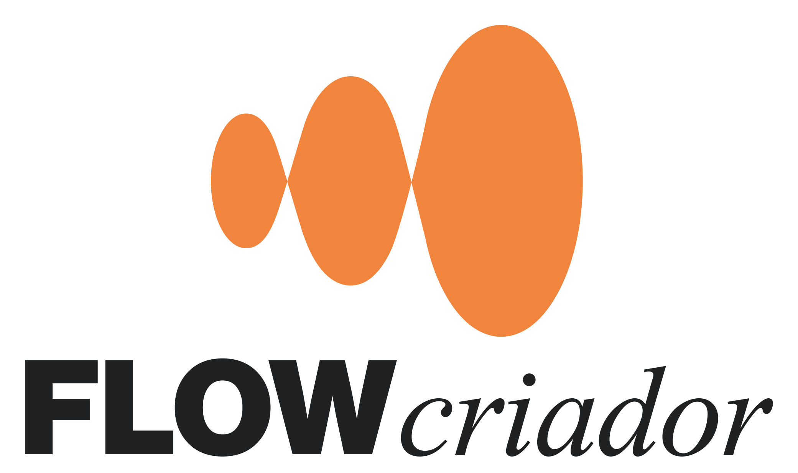

[🇧🇷 Português](./README-pt.md)

<div align="center">
  
  <br/>
  <br/>
  <p>
    <strong>AI Assistant for Notion</strong>
  </p>
  <p>
    <a href="https://notionassistant.llmway.com.br">Online Demo</a> •
    <a href="#-quick-start-in-3-steps">Quick Start in 3 Steps</a> •
    <a href="./docs-public/en-us/03-contribution/00-how-to-contribute.md">Contribute</a> •
    <a href="https://docs.notionassistant.llmway.com.br/">Documentation</a>
  </p>
  <p>
    
    
    
    <a href="https://buymeacoffee.com/igorrozalem"></a>
  </p>
</div>

## 🧠 What is Notion Assistant?

Notion Assistant is an open-source application that integrates advanced language models (LLMs) with Notion, allowing you to:

- 🤖 Query and receive intelligent answers about your Notion content
- 📝 Generate texts, summaries and ideas directly in Notion
- 🔍 Search your pages with semantic understanding
- 📊 Organize and structure information automatically

## 🚀 Quick Start in 3 Steps

<br>

### 1️⃣ Clone the repository

```bash
# Clone the repository
git clone https://github.com/igorhlr/NotionAiAssistant.git
cd NotionAiAssistant
```

### 2️⃣ Configure data path (optional)

```bash
# Edit the configuration file with your preferred editor
nano config/local-env.conf

# Add your custom path (example for macOS):
DOCKER_DATA_PATH=/Users/youruser/Documents/Projects/NotionAiAssistant
```

### 3️⃣ Start with the automated script

```bash
# Give execution permission to the script
chmod +x scripts/automated-deploy-dev.sh

# Run the automated deploy script
./scripts/automated-deploy-dev.sh
```

**And that's it!** 🎉 The application will be available at:
- 🌐 **Frontend:** http://localhost:8501
- 🔌 **API:** http://localhost:8080

The system offers **hot reload** - your code changes will be applied automatically!

## 🛠️ Additional Configurations

### Custom ports

```bash
# Format: ./scripts/automated-deploy-dev.sh [clean] [rotate_secrets] [frontend_port] [api_port]
./scripts/automated-deploy-dev.sh false false 3000 8080
```

### Force complete cleanup

```bash
# Start with complete environment cleanup
./scripts/automated-deploy-dev.sh true
```

### Using Makefile (alternative)

```bash
# Start development environment
make dev

# Start clean environment
make dev-clean

# Show all available commands
make help
```

## 🔧 Docker Data Path Configuration

NotionAiAssistant stores your data in Docker volumes to ensure persistence. You can easily customize where this data will be stored:

### Configuration Examples  

- **macOS**: `DOCKER_DATA_PATH=/Users/youruser/Documents/Projects/NotionAiAssistant`
- **Linux**: `DOCKER_DATA_PATH=/home/youruser/projects/NotionAiAssistant`
- **Windows (WSL)**: `DOCKER_DATA_PATH=/mnt/c/Users/youruser/Documents/Projects/NotionAiAssistant`

The system will automatically create the necessary directory structure within the defined path.

## 🌟 Features

- **Notion Integration**: Connect directly to your Notion account
- **AI Assistant**: Interact with the assistant for queries and tasks in Notion
- **Multiple Models**: Choose between different LLM models for your needs
- **Interaction History**: Track and resume previous conversations
- **Customization**: Adapt the assistant to your specific needs

## 🛠️ Technologies

- **Frontend**: Streamlit
- **Backend**: FastAPI, Python 3.10+
- **Database**: PostgreSQL 15
- **Infrastructure**: Docker, Traefik, automated CI/CD
- **Integrations**: Notion API, LLM APIs (OpenAI, Anthropic, DeepSeek)

## 📊 Screenshots

<div align="left">
  <p>Home screen with usage guide, how to obtain keys, page ID and settings.</p>
  
  <br>
  <br>
   <p>Screen showing the execution of a prompt to analyze our page and recreate it creatively and improve it.</p>
  
  <br>
  <br>
   <p>Result on the screen redirecting to the created notion page.</p>
   
  <br>
  <br>
   <p>Page opened in Notion to check the result, this was one of the graphs generated in the content, the rest is structured there on the right.</p>
  
</div>

## ❓ Common Troubleshooting

| Problem | Solution |
|----------|---------|
| **"Containers won't start"** | Check if Docker is running: `docker ps` |
| **"Permission error"** | Run: `chmod -R 755 ./config/secrets` |
| **"Ports already in use"** | Change ports: `./scripts/automated-deploy-dev.sh false false 3001 8081` |
| **"Can't access application"** | Check if containers are running: `docker ps \| grep notionia` |
| **"How to view logs?"** | Run: `docker logs notionia_dev_app` |

## 🤝 How to Contribute

Contributions are welcome! To contribute:

1. Read our [Contribution Guide](./docs-public/en-us/03-contribution/00-how-to-contribute.md)
2. Set up the environment following the instructions above
3. Explore [open issues](https://github.com/igorhlr/NotionAiAssistant/issues)
4. Submit a pull request following the guidelines

## 📄 Complete Documentation

For more detailed information, check our full documentation:

### 📚 Documentation Links

- [**Project Maps**](./docs-public/en-us/00-maps/): View structure and architecture
  -  [Front Overview](./docs-public/en-us/00-maps/00-front.md)
  -  [Complete Application](./docs-public/en-us/00-maps/01-appComplete.md)

- [**How to Run**](./docs-public/en-us/01-how-to-run/): Detailed installation instructions
  -  [Setting Up Environment](./docs-public/en-us/01-how-to-run/00-setting-up-environment.md)
  -  [Docker Compose](./docs-public/en-us/01-how-to-run/01-docker-compose.md)
  -  [Development with Hot Reload](./docs-public/en-us/01-how-to-run/02-development-with-hotreload.md)
  -  [Secrets Management](./docs-public/en-us/01-how-to-run/03-secrets-management.md)
  -  [Configuring Docker Data Path](./docs-public/en-us/01-how-to-run/04-configuring-docker-data-path.md)

- [**Architecture**](./docs-public/en-us/02-architecture/): Technical implementation details
  -  [Overview](./docs-public/en-us/02-architecture/00-overview.md)
  -  [Frontend](./docs-public/en-us/02-architecture/01-frontend.md)
  -  [Backend](./docs-public/en-us/02-architecture/02-backend.md)

- [**How to Contribute**](./docs-public/en-us/03-contribution/): Contribution guides
  -  [How to Contribute](./docs-public/en-us/03-contribution/00-how-to-contribute.md)
  -  [Code Standard](./docs-public/en-us/03-contribution/01-code-standart.md)
  -  [PR Flow](./docs-public/en-us/03-contribution/02-pr-flow.md)

- [**CI/CD**](./docs-public/en-us/04-ci-cd/): Educational overview of continuous integration and delivery
  -  [Overview](./docs-public/en-us/04-ci-cd/00-overview.md)

## 💖 Support the Project

If you found this project useful and would like to support its continued development, consider buying the developer a coffee:

<div align="center">
  <!-- <a href="https://buymeacoffee.com/igorrozalem" target="_blank">
    
  </a> -->
<a href="https://buymeacoffee.com/igorrozalem" target="_blank"></a>

<br>
  <a href="https://buymeacoffee.com/igorrozalem" target="_blank">
    
  </a>
</div>
<br>
Your support helps keep the project updated and add new features!

## 📝 License

This project is licensed under the [MIT License](./LICENSE).

## 🙏 Acknowledgments

### Special Thanks To:

<div align="center">
  <a href="https://flowcriador.com" target="_blank">
    
  </a>
</div>
<br>

The methodology from [FlowCriador](https://flowcriador.com) was fundamental in developing this project, helping to:

- **Collect** and organize information in a structured way in Notion
- **Combine** different ideas to generate innovative solutions
- **Create** concrete implementations more efficiently

### How FlowCriador Helped Us

<div align="center">
  <br>
  <em>FlowCriador main page where we started our project</em>
</div>

<br>

<div align="center">
  <br>
  <em>Organizing ideas and structuring the NotionAiAssistant project</em>
</div>

<br>

<div align="center">
  <br>
  <em>Tracking development progress systematically</em>
</div>

<br>

<div align="center">
  <br>
  <em>Project successfully completed using FlowCriador methodology</em>
</div>

The FlowCriador approach allowed us to:
- Maintain focus on the project's main objectives
- Organize development systematically
- Quickly adapt to new needs and feedback
- Prioritize features based on real value for users

### Open-Source Community

This project benefits from numerous tools and libraries developed by the open-source community:

- **Python Community**: For creating and maintaining a powerful and accessible language
- **FastAPI Team**: For developing a framework that combines performance and ease of use
- **Streamlit Team**: For providing tools that simplify interface creation
- **Docker Community**: For revolutionizing how we develop and deploy applications
- **PostgreSQL Community**: For maintaining one of the most robust and reliable databases
- **Notion Team**: For creating an API that enables powerful integrations
- **GitHub**: For providing tools that facilitate collaboration and open-source development

---

<div align="center">
  <h3>Created by Igor Rozalem</h3>
  <a href="https://github.com/igorhlr"></a>
  <a href="https://www.linkedin.com/in/igor-rozalem-a67560209/"></a>
  <a href="https://buymeacoffee.com/igorrozalem"></a>
  <br/><br/>
  <p>
    <a href="https://notionassistant.llmway.com.br">📱 Web Application</a> •
    <a href="https://docs.notionassistant.llmway.com.br">📚 Documentation</a> •
    <a href="https://github.com/igorhlr/NotionAiAssistant/issues">🐛 Report Bug</a> •
    <a href="https://github.com/igorhlr/NotionAiAssistant/issues">💡 Suggest Feature</a>
  </p>
  <p><em>"The best way to predict the future is to create it."</em></p>
</div>