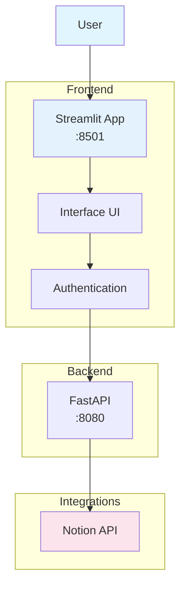
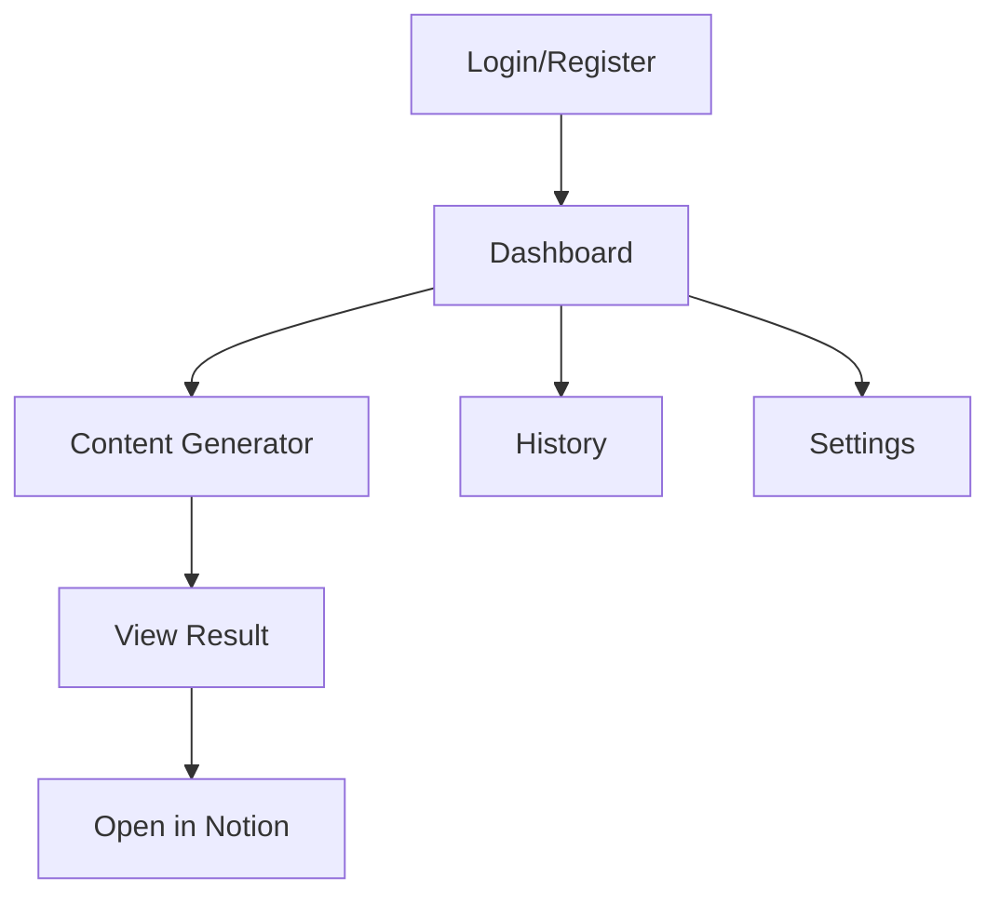

# Frontend Architecture - Notion Assistant

This document details the architecture of the Notion Assistant frontend, including its components, interaction flows, and design patterns.

## Overview

The Notion Assistant frontend is built with Streamlit, providing an intuitive and responsive interface for interacting with the Notion assistant.



## Frontend Structure

The frontend follows an organized structure:

```
frontend/
├── main.py                # Application entry point
├── pages/                 # Application pages
│   ├── login.py           # Login/registration page
│   ├── dashboard.py       # Main dashboard
│   ├── generator.py       # Content generator
│   ├── history.py         # Interaction history
│   └── settings.py        # User settings
├── components/            # Reusable components
│   ├── header.py          # Application header
│   ├── sidebar.py         # Navigation sidebar
│   ├── notion_preview.py  # Notion content preview
│   └── modals.py          # Modal components
├── services/              # API communication services
│   ├── api.py             # Base API client
│   ├── auth.py            # Authentication service
│   ├── content.py         # Content generation service
│   └── notion.py          # Notion service
└── utils/                 # Utilities
    ├── session.py         # Session management
    ├── formatting.py      # Text/content formatting
    └── validation.py      # Input validation
```

## Main Pages

### Login/Registration Page

The login/registration page is the application's entry point:

```python
# pages/login.py
import streamlit as st
from services.auth import login_user, register_user

def show_login_page():
    st.title("Notion Assistant")
    
    tab1, tab2 = st.tabs(["Login", "Register"])
    
    with tab1:
        with st.form("login_form"):
            email = st.text_input("Email")
            password = st.text_input("Password", type="password")
            submit = st.form_submit_button("Login")
            
            if submit:
                if email and password:
                    success, data = login_user(email, password)
                    if success:
                        st.session_state.token = data["token"]
                        st.session_state.user_info = data["user"]
                        st.session_state.logged_in = True
                        st.experimental_rerun()
                    else:
                        st.error(data["message"])
                else:
                    st.error("Please fill in all fields")
    
    with tab2:
        with st.form("register_form"):
            username = st.text_input("Username")
            email = st.text_input("Email")
            password = st.text_input("Password", type="password")
            password_confirm = st.text_input("Confirm Password", type="password")
            submit = st.form_submit_button("Register")
            
            if submit:
                if username and email and password and password_confirm:
                    if password != password_confirm:
                        st.error("Passwords do not match")
                    else:
                        success, data = register_user(username, email, password)
                        if success:
                            st.success("Registration complete! Please log in.")
                        else:
                            st.error(data["message"])
                else:
                    st.error("Please fill in all fields")
```

## Key Features

1. **State Management**: Uses Streamlit's session state
2. **Responsive Design**: Works on desktop and mobile
3. **Modular Architecture**: Components are reusable
4. **API Integration**: Communicates with backend services
5. **Notion Integration**: Direct preview and editing capabilities

## Navigation Flow



## Next Steps

1. Add dark mode support
2. Implement offline capabilities
3. Enhance accessibility features
4. Add more customization options