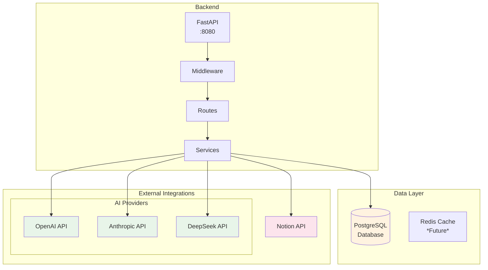
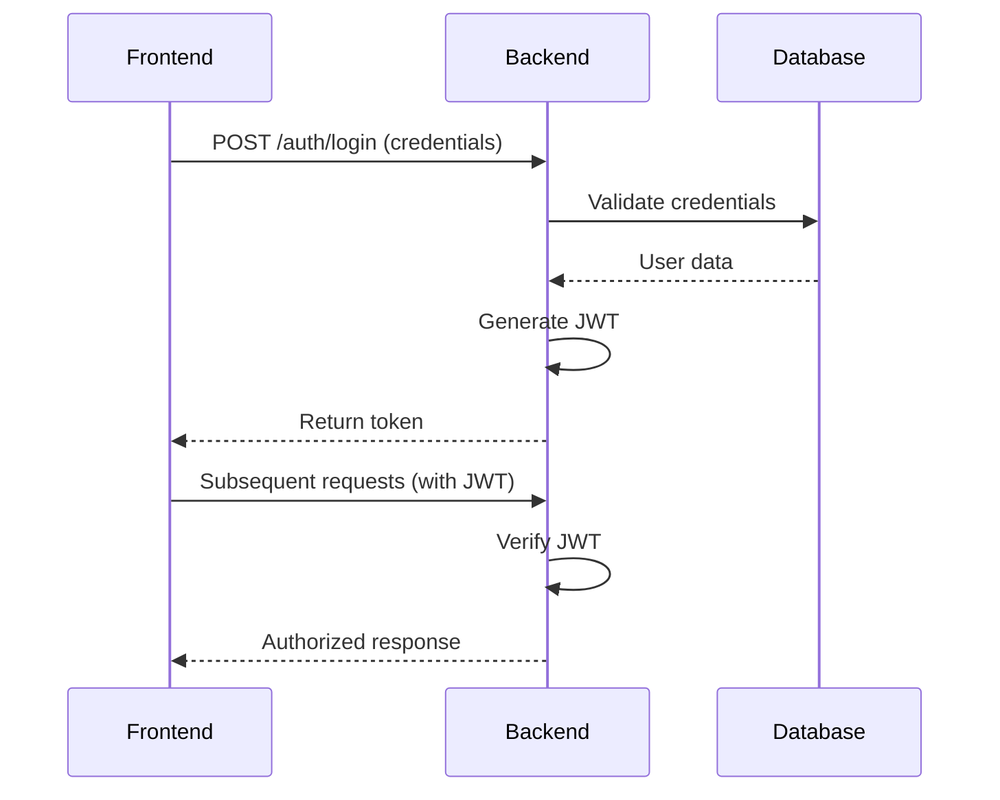
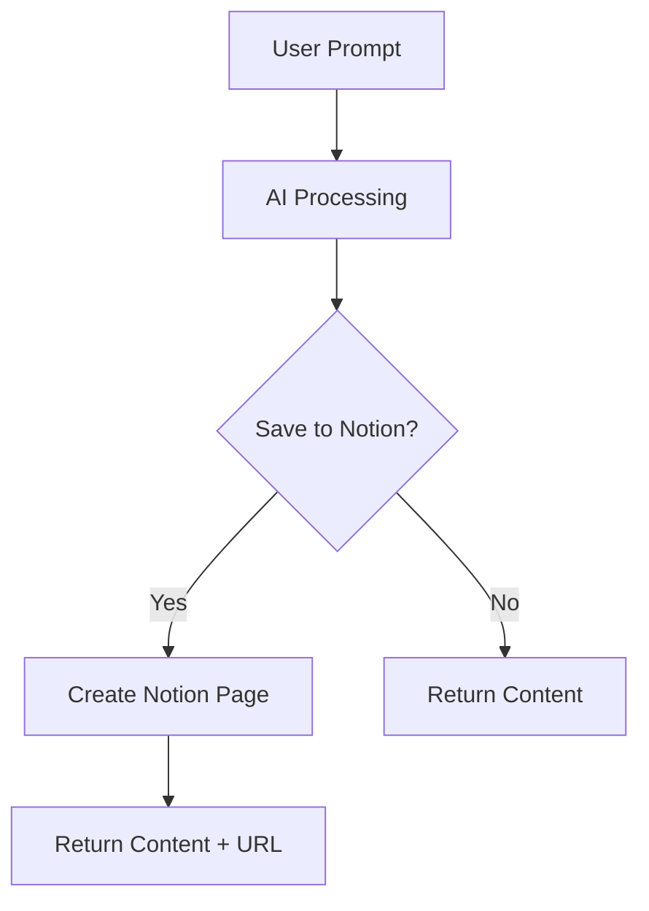
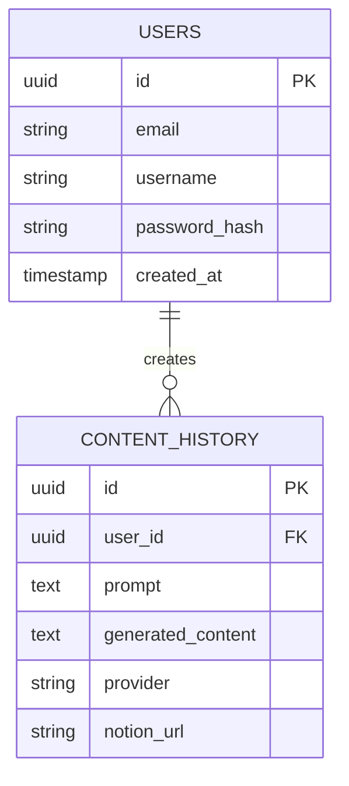

# Backend Architecture - Notion Assistant

This document details the architecture of the Notion Assistant backend, including its components, data flows, and design patterns.

## Overview

The Notion Assistant backend is built with FastAPI, providing a RESTful API that manages communication between the user interface, PostgreSQL database, and external integrations.



## Key Components

### 1. API Layer
- RESTful endpoints for frontend communication
- Request/response validation
- Authentication handling

### 2. Service Layer
- Business logic implementation
- AI content generation
- Notion integration
- User management

### 3. Data Layer
- PostgreSQL database
- Repository pattern for data access
- Future Redis caching

### 4. Integration Layer
- OpenAI/Anthropic/DeepSeek APIs
- Notion API
- Authentication providers

## Authentication Flow



## Content Generation Flow



## Database Schema



## Error Handling

The backend implements consistent error responses:

```json
{
    "detail": "Error message",
    "status": 400,
    "code": "INVALID_INPUT"
}
```

## Security Measures

1. JWT authentication
2. Password hashing (bcrypt)
3. Input validation
4. Rate limiting
5. CORS restrictions

## Future Improvements

1. Implement Redis caching
2. Add monitoring/metrics
3. Support additional AI providers
4. Expand Notion integration features