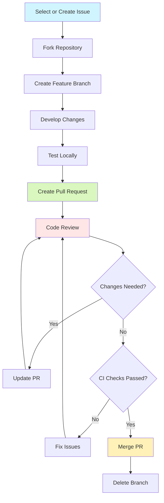
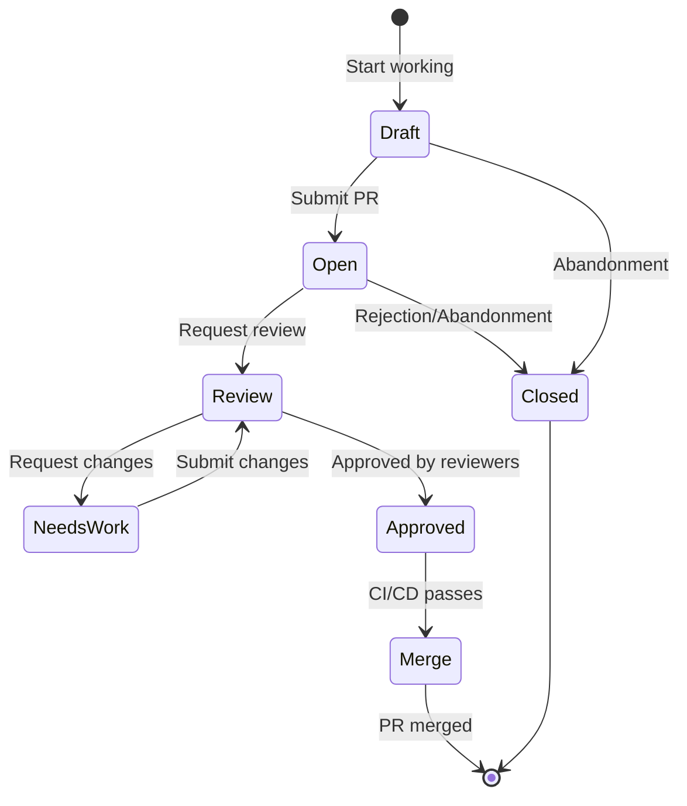
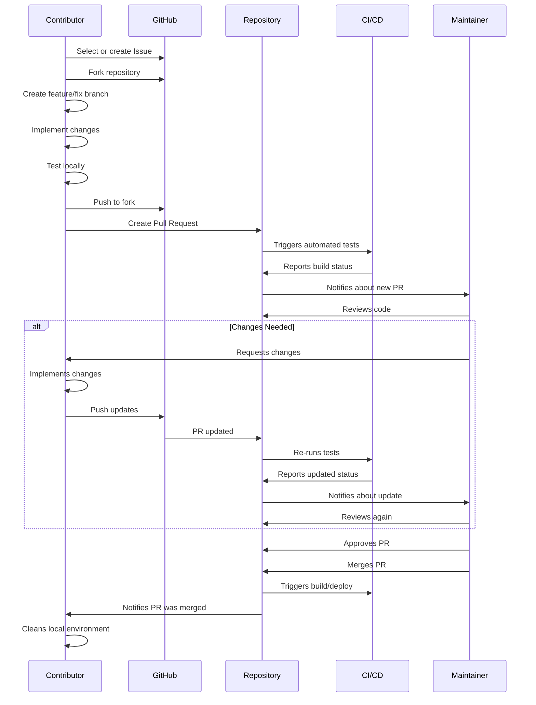

# Pull Request Flow - Notion Assistant

This document details the Pull Request (PR) contribution process for the Notion Assistant project, from initial preparation to review and merge.

## Flow Overview



## 1. Preparation

### 1.1 Select or Create an Issue

Before starting any work:

1. Check [existing issues](https://github.com/igorhlr/NotionAiAssistant/issues) to see if the change you want to make has already been discussed
2. Look for issues labeled `good first issue` if this is your first contribution
3. If necessary, create a new issue describing the problem or improvement

```bash
# Example of searching issues by tags
gh issue list --label "good first issue"
# or
gh issue list --label "bug"
```

### 1.2 Fork the Repository

Create a fork of the repository to your account:

1. Go to the [repository page](https://github.com/igorhlr/NotionAiAssistant)
2. Click the "Fork" button in the top-right corner
3. Clone your fork locally:

```bash
git clone https://github.com/your-username/NotionAiAssistant.git
cd NotionAiAssistant

# Add the original repository as a remote
git remote add upstream https://github.com/igorhlr/NotionAiAssistant.git
```

### 1.3 Create a Feature Branch

Create a specific branch for your contribution:

```bash
# Update your local main branch
git checkout main
git pull upstream main

# Create feature branch
git checkout -b feature/descriptive-name
# or
git checkout -b fix/bug-name
# or
git checkout -b docs/documentation-name
```

Branch naming conventions:
- `feature/` - for new features
- `fix/` - for bug fixes
- `docs/` - for documentation improvements
- `refactor/` - for code refactoring
- `test/` - for adding or improving tests

## 2. Development

### 2.1 Implement Changes

Develop your contribution following the project's [Code Standards](./01-code-standards.md):

1. Write clean and well-documented code
2. Add tests for new features
3. Update documentation as needed

### 2.2 Frequent Commits

Make regular and meaningful commits:

```bash
# Add specific files
git add path/to/file.py

# Commit with a descriptive message
git commit -m "feat: implement content generation with Claude API"
```

We follow the [Conventional Commits](https://www.conventionalcommits.org/) standard:
- `feat:` - new feature
- `fix:` - bug fix
- `docs:` - documentation changes
- `style:` - formatting, semicolons, etc.; no code change
- `refactor:` - code refactoring
- `test:` - adding or fixing tests
- `chore:` - build task updates, configurations, etc.

### 2.3 Stay Updated

Regularly sync your branch with the main branch of the upstream repository:

```bash
git fetch upstream
git rebase upstream/main
```

### 2.4 Test Locally

Before submitting your PR, run all tests to ensure your changes don't break anything:

```bash
# Set up environment
python -m venv venv
source venv/bin/activate  # Linux/Mac
# or
venv\Scripts\activate  # Windows

pip install -r requirements-dev.txt

# Run linting
black app/ tests/
flake8 app/ tests/
mypy app/

# Run tests
pytest

# Run tests with coverage
pytest --cov=app --cov-report=term-missing
```

## 3. Pull Request Submission

### 3.1 Final Preparation

Before creating the PR:

1. Rebase your branch with the latest main branch:
   ```bash
   git fetch upstream
   git rebase upstream/main
   ```

2. Ensure all tests pass:
   ```bash
   pytest
   ```

3. Ensure code quality tools are satisfied:
   ```bash
   black --check app/ tests/
   flake8 app/ tests/
   mypy app/
   ```

4. Update CHANGELOG.md if applicable

### 3.2 Create the Pull Request

Push your changes to your fork and create the PR:

```bash
# Push changes to your fork
git push origin feature/descriptive-name

# Create PR via command line (optional)
gh pr create --title "PR Title" --body "Detailed description"
```

Alternatively, you can create the PR via GitHub's web interface:
1. Go to the [original repository page](https://github.com/igorhlr/NotionAiAssistant)
2. Click "Pull Requests" and then "New Pull Request"
3. Click "compare across forks"
4. Select your fork and the branch containing your changes

### 3.3 Pull Request Template

Fill out the PR template with detailed information:

```markdown
## Description

[Clearly describe what was changed and why]

## Type of Change

- [ ] 🐛 Bug fix
- [ ] ✨ New feature
- [ ] 📚 Documentation update
- [ ] 🧹 Refactoring/improvement
- [ ] 🧪 Test addition/update
- [ ] 🔄 Dependency update

## Related Issue

Fixes #[issue number]

## How to Test

[Step-by-step instructions to test the changes]

## Checklist

- [ ] My code follows the project standards
- [ ] I added tests proving my fix/feature works
- [ ] I updated documentation as needed
- [ ] All new and existing tests pass
```

### 3.4 Link to Issue

Link your PR to the issue it resolves:
- In the PR body, include "Fixes #123" or "Closes #123" (where 123 is the issue number)
- This will automatically link the PR to the issue and close the issue when the PR is merged

## 4. Code Review

### 4.1 Review Process

After PR submission:

1. Project maintainers will be notified and review the code
2. CI/CD will run automated checks
3. Reviewers may leave comments, suggestions, or request changes

### 4.2 Responding to Comments

When receiving feedback:

1. Respond to all comments clearly and politely
2. Make requested changes in new commits
3. Push changes to the same branch:
   ```bash
   git add .
   git commit -m "fix: correction based on PR feedback"
   git push origin feature/descriptive-name
   ```
4. When changes are complete, comment on the PR to notify reviewers

### 4.3 Resolving Conflicts

If there are conflicts between your branch and the main branch:

```bash
git fetch upstream
git rebase upstream/main

# Resolve conflicts manually
# After resolving conflicts:
git add .
git rebase --continue

# Force push to update your PR
git push origin feature/descriptive-name --force-with-lease
```

## 5. Merge and Completion

### 5.1 Merge Requirements

A PR is ready to merge when:

1. Approved by at least one project maintainer
2. All CI checks pass
3. Code follows project standards
4. Functionality has been adequately tested

### 5.2 Merge Process

Typically, a project maintainer will perform the merge:

1. Squash and merge (preferred for smaller PRs)
   - Consolidates all commits into a single clean commit
   - Keeps the main history clean

2. Rebase and merge (for larger PRs with significant history)
   - Preserves the feature commit history
   - Maintains a linear history

### 5.3 Post-Merge

After the PR is merged:

1. The main branch will be updated automatically
2. The linked issue will be closed automatically (if configured correctly)
3. CI/CD will run the build and deploy process
4. Your contribution will be part of the next release

### 5.4 Cleanup

Clean up your local environment:

```bash
# Return to the main branch
git checkout main

# Update with the latest changes
git pull upstream main

# Delete the local branch
git branch -d feature/descriptive-name

# Delete the remote branch (optional)
git push origin --delete feature/descriptive-name
```

## 6. PR Lifecycle



## 7. Best Practices

### 7.1 PR Size

- **Keep PRs small and focused**: A PR should implement a single feature or fix
- **Avoid giant PRs**: PRs with more than 500 changed lines are difficult to review
- If your change is large, consider splitting it into multiple smaller PRs

### 7.2 Communication

- **Be clear and descriptive**: Explain what and why you are changing
- **Respond promptly**: Respond to comments and change requests as soon as possible
- **Be patient**: Maintainers are often volunteers with limited time

### 7.3 Testing

- **Test everything**: Add tests for new features and bug fixes
- **Don't reduce coverage**: Your code should maintain or improve test coverage
- **Think of edge cases**: Test error scenarios and edge cases

### 7.4 Documentation

- **Update documentation**: Ensure documentation is updated with your changes
- **Docstrings**: Add docstrings for new functions, classes, and methods
- **README/CHANGELOG**: Update if necessary

## 8. Full Contribution Cycle



## 9. FAQ

### 9.1 How to handle multiple commits in a PR?

We recommend keeping a clean commit history. Before submitting your PR, you can consolidate your commits:

```bash
# Interactively rebase your last N commits
git rebase -i HEAD~N

# In the editor, change 'pick' to 'squash' or 's' to combine commits
# Keep the first commit as 'pick' and the rest as 'squash'
```

### 9.2 What to do if CI fails?

1. Click the details link to see what failed
2. Fix the issues locally
3. Commit the changes and push
4. CI will run again automatically

### 9.3 How long does it take for a PR to be reviewed?

Review time varies depending on PR complexity and maintainer availability. Smaller, focused PRs are usually reviewed faster.

### 9.4 Can I work on multiple PRs at the same time?

Yes, but we recommend:
- Using different branches for each PR
- Keeping PRs independent to facilitate review and merge

## 10. Additional Resources

- [GitHub PR Guide](https://docs.github.com/en/pull-requests)
- [Conventional Commits Guide](https://www.conventionalcommits.org/)
- [Rebasing Guide](https://git-scm.com/book/en/v2/Git-Branching-Rebasing)
- [How to Write Good Commit Messages](https://chris.beams.io/posts/git-commit/)

## Conclusion

Following this PR flow ensures a smooth and efficient contribution experience for everyone involved. We greatly appreciate your contributions to Notion Assistant and helping make it better for all users!
