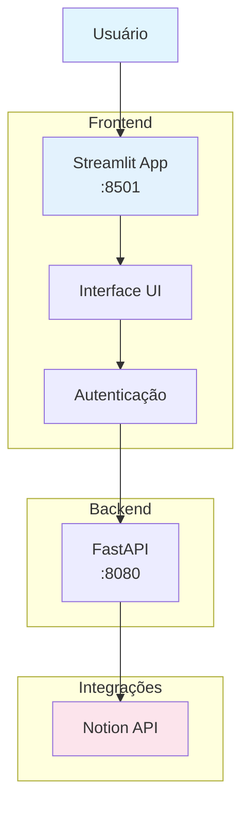
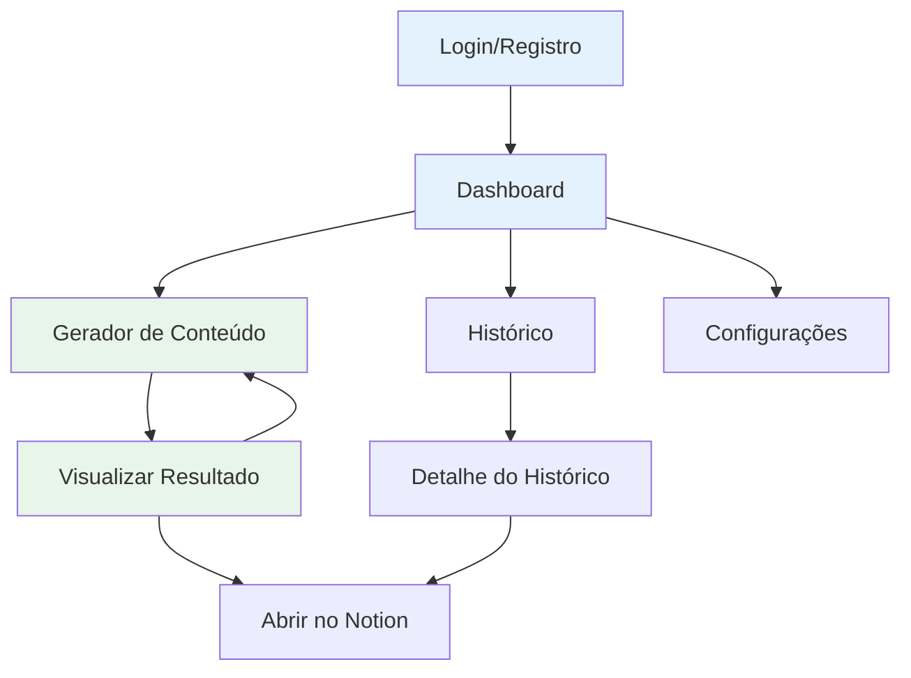
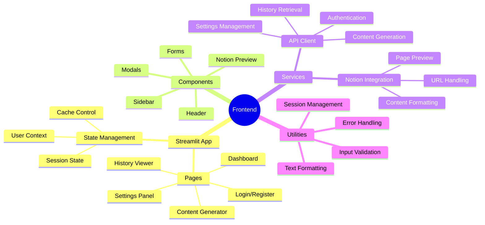
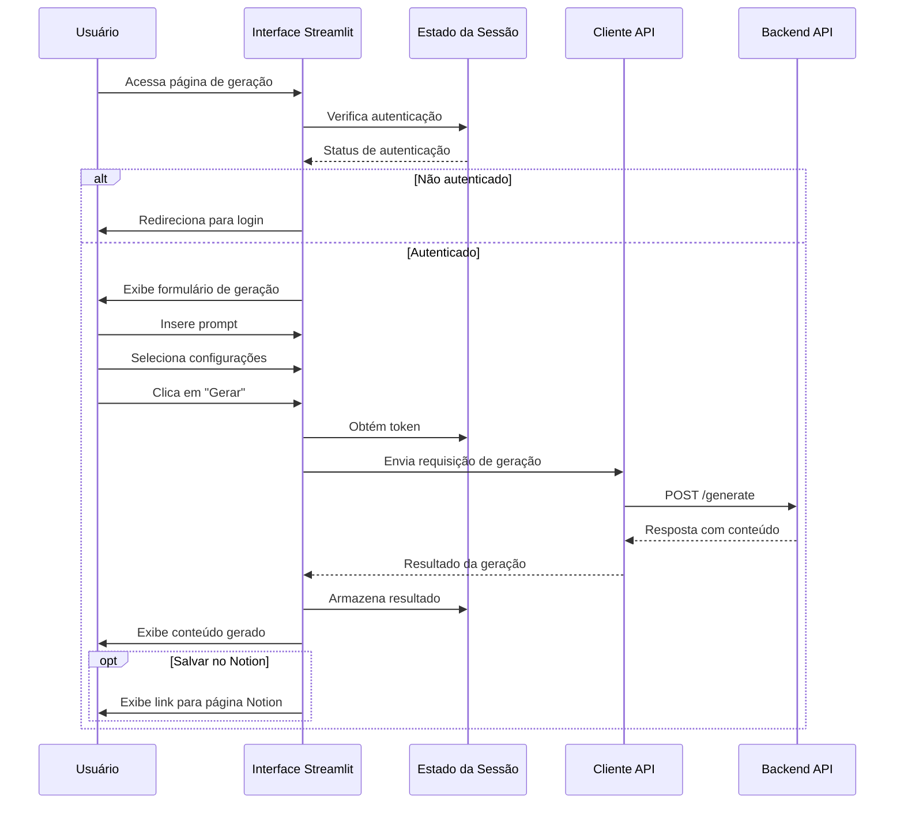

# Arquitetura Frontend -  Notion Assistant

Este documento detalha a arquitetura do frontend do  Notion Assistant, incluindo seus componentes, fluxos de interação e padrões de design.

## Visão Geral

O frontend do  Notion Assistant é construído com Streamlit, fornecendo uma interface intuitiva e responsiva para interação com o assistente Notion.



## Estrutura do Frontend

O frontend segue uma estrutura organizada:

```
frontend/
├── main.py                # Ponto de entrada da aplicação
├── pages/                 # Páginas da aplicação
│   ├── login.py           # Página de login/registro
│   ├── dashboard.py       # Dashboard principal
│   ├── generator.py       # Gerador de conteúdo
│   ├── history.py         # Histórico de interações
│   └── settings.py        # Configurações do usuário
├── components/            # Componentes reutilizáveis
│   ├── header.py          # Cabeçalho da aplicação
│   ├── sidebar.py         # Barra lateral de navegação
│   ├── notion_preview.py  # Visualização de conteúdo Notion
│   └── modals.py          # Componentes de modal
├── services/              # Serviços para comunicação com API
│   ├── api.py             # Cliente API base
│   ├── auth.py            # Serviço de autenticação
│   ├── content.py         # Serviço de geração de conteúdo
│   └── notion.py          # Serviço Notion
└── utils/                 # Utilitários
    ├── session.py         # Gerenciamento de sessão
    ├── formatting.py      # Formatação de texto/conteúdo
    └── validation.py      # Validação de entrada
```

## Páginas Principais

### Página de Login/Registro

A página de login/registro é a porta de entrada da aplicação, como mostrado na imagem compartilhada:


```python
# pages/login.py
import streamlit as st
from services.auth import login_user, register_user

def show_login_page():
    st.title(" Notion Assistant")
    
    # Abas para login/registro
    tab1, tab2 = st.tabs(["Entrar", "Registrar"])
    
    with tab1:
        with st.form("login_form"):
            email = st.text_input("Email")
            password = st.text_input("Senha", type="password")
            submit = st.form_submit_button("Entrar")
            
            if submit:
                if email and password:
                    success, data = login_user(email, password)
                    if success:
                        # Salvar token na sessão
                        st.session_state.token = data["token"]
                        st.session_state.user_info = data["user"]
                        st.session_state.logged_in = True
                        st.experimental_rerun()
                    else:
                        st.error(data["message"])
                else:
                    st.error("Por favor, preencha todos os campos")
    
    with tab2:
        with st.form("register_form"):
            username = st.text_input("Nome de usuário")
            email = st.text_input("Email")
            password = st.text_input("Senha", type="password")
            password_confirm = st.text_input("Confirmar senha", type="password")
            submit = st.form_submit_button("Registrar")
            
            if submit:
                if username and email and password and password_confirm:
                    if password != password_confirm:
                        st.error("As senhas não coincidem")
                    else:
                        success, data = register_user(username, email, password)
                        if success:
                            st.success("Registro concluído! Faça login para continuar.")
                        else:
                            st.error(data["message"])
                else:
                    st.error("Por favor, preencha todos os campos")
```

### Dashboard Principal

O dashboard fornece uma visão geral do uso e acesso rápido às funcionalidades:

```python
# pages/dashboard.py
import streamlit as st
from components.header import show_header
from components.sidebar import show_sidebar
from services.content import get_recent_history

def show_dashboard():
    show_header()
    show_sidebar()
    
    st.title("Dashboard")
    
    # Estatísticas de uso
    col1, col2, col3 = st.columns(3)
    with col1:
        st.metric("Conteúdos Gerados", "42")
    with col2:
        st.metric("Páginas Notion", "23")
    with col3:
        st.metric("Modelos Utilizados", "3")
    
    # Histórico recente
    st.subheader("Atividade Recente")
    recent_history = get_recent_history(limit=5)
    
    if recent_history:
        for item in recent_history:
            with st.expander(f"{item['prompt'][:50]}... ({item['created_at']})"):
                st.write(item["generated_content"][:200] + "...")
                if item.get("notion_url"):
                    st.markdown(f"[Ver no Notion]({item['notion_url']})")
    else:
        st.info("Nenhuma atividade recente encontrada. Comece gerando conteúdo!")
    
    # Links rápidos
    st.subheader("Ações Rápidas")
    col1, col2 = st.columns(2)
    with col1:
        if st.button("Novo Conteúdo", use_container_width=True):
            st.session_state.page = "generator"
            st.experimental_rerun()
    with col2:
        if st.button("Configurações", use_container_width=True):
            st.session_state.page = "settings"
            st.experimental_rerun()
```

### Gerador de Conteúdo

O núcleo da aplicação, onde os usuários interagem com o assistente:

```python
# pages/generator.py
import streamlit as st
from components.header import show_header
from components.sidebar import show_sidebar
from services.content import generate_content
from services.api import get_providers

def show_generator():
    show_header()
    show_sidebar()
    
    st.title("Gerador de Conteúdo")
    
    # Obter lista de provedores disponíveis
    providers = get_providers()
    
    # Formulário de geração
    with st.form("generator_form"):
        prompt = st.text_area("O que você gostaria de criar?", height=150)
        
        col1, col2 = st.columns(2)
        with col1:
            provider = st.selectbox("Modelo de IA", providers)
        with col2:
            save_to_notion = st.checkbox("Salvar no Notion", value=True)
        
        submit = st.form_submit_button("Gerar Conteúdo")
        
        if submit:
            if prompt:
                with st.spinner("Gerando conteúdo..."):
                    success, data = generate_content(
                        prompt=prompt,
                        provider=provider,
                        save_to_notion=save_to_notion
                    )
                    
                    if success:
                        st.session_state.last_generated = data
                        st.success("Conteúdo gerado com sucesso!")
                    else:
                        st.error(f"Erro: {data['message']}")
            else:
                st.error("Por favor, insira um prompt para gerar conteúdo")
    
    # Exibir resultado se disponível
    if "last_generated" in st.session_state:
        st.subheader("Conteúdo Gerado")
        st.markdown(st.session_state.last_generated["content"])
        
        if st.session_state.last_generated.get("notion_url"):
            st.success(f"Conteúdo salvo no Notion! [Abrir página]({st.session_state.last_generated['notion_url']})")
```

## Fluxo de Navegação

O fluxo de navegação do usuário é intuitivo:



## Gerenciamento de Estado

O frontend utiliza o gerenciamento de estado do Streamlit para controlar a navegação e dados do usuário:

```python
# utils/session.py
import streamlit as st

def initialize_session():
    """Inicializa variáveis de sessão."""
    if "logged_in" not in st.session_state:
        st.session_state.logged_in = False
        
    if "page" not in st.session_state:
        st.session_state.page = "dashboard"
        
    if "token" not in st.session_state:
        st.session_state.token = None
        
    if "user_info" not in st.session_state:
        st.session_state.user_info = None

def navigate_to(page):
    """Navega para uma página específica."""
    st.session_state.page = page
    
def logout():
    """Realiza logout do usuário."""
    st.session_state.logged_in = False
    st.session_state.token = None
    st.session_state.user_info = None
    st.session_state.page = "login"
```

## Comunicação com o Backend

O frontend se comunica com o backend via API REST:

```python
# services/api.py
import requests
import streamlit as st

BASE_URL = "http://localhost:8080/api"

def get_headers():
    """Retorna os headers para requisições autenticadas."""
    return {
        "Authorization": f"Bearer {st.session_state.token}"
    } if st.session_state.get("token") else {}

def get(endpoint, params=None):
    """Realiza requisição GET para a API."""
    try:
        response = requests.get(
            f"{BASE_URL}/{endpoint}",
            headers=get_headers(),
            params=params
        )
        response.raise_for_status()
        return True, response.json()
    except requests.exceptions.RequestException as e:
        return False, {"message": str(e)}

def post(endpoint, data=None):
    """Realiza requisição POST para a API."""
    try:
        response = requests.post(
            f"{BASE_URL}/{endpoint}",
            headers=get_headers(),
            json=data
        )
        response.raise_for_status()
        return True, response.json()
    except requests.exceptions.RequestException as e:
        return False, {"message": str(e)}
```

## Interface Responsiva

O frontend é projetado para ser responsivo e amigável em diferentes dispositivos:

```python
# components/header.py
import streamlit as st
from utils.session import logout

def show_header():
    """Exibe o cabeçalho da aplicação."""
    col1, col2 = st.columns([3, 1])
    
    with col1:
        st.title(" Notion Assistant")
    
    with col2:
        if st.session_state.user_info:
            st.write(f"Olá, {st.session_state.user_info['username']}")
            if st.button("Logout"):
                logout()
                st.experimental_rerun()
```

## Integração com Notion

O frontend fornece visualização e integração com o Notion:

```python
# components/notion_preview.py
import streamlit as st
import requests
from PIL import Image
from io import BytesIO

def show_notion_preview(notion_url):
    """Exibe uma prévia da página do Notion."""
    st.subheader("Prévia do Notion")
    
    try:
        # Em um cenário real, aqui poderia ser uma chamada à API do Notion
        # ou uma captura de tela do conteúdo
        st.info("Pré-visualização da página do Notion")
        
        # Exibir link para a página
        st.markdown(f"[Abrir no Notion]({notion_url})")
        
        # Exibir botões de ação
        col1, col2 = st.columns(2)
        with col1:
            if st.button("Editar no Notion"):
                st.markdown(f'<script>window.open("{notion_url}", "_blank")</script>', unsafe_allow_html=True)
        with col2:
            if st.button("Copiar Link"):
                st.code(notion_url)
                st.success("Link copiado!")
    except Exception as e:
        st.error(f"Erro ao carregar prévia: {str(e)}")
```

## Customização da Interface

O frontend permite que usuários personalizem sua experiência:

```python
# pages/settings.py
import streamlit as st
from components.header import show_header
from components.sidebar import show_sidebar
from services.api import post, get

def show_settings():
    show_header()
    show_sidebar()
    
    st.title("Configurações")
    
    # Obter configurações atuais
    success, current_settings = get("user/settings")
    
    if not success:
        st.error("Erro ao carregar configurações")
        return
    
    # Abas de configurações
    tab1, tab2, tab3 = st.tabs(["Geral", "Notion", "Provedores IA"])
    
    with tab1:
        st.subheader("Configurações Gerais")
        
        theme = st.selectbox(
            "Tema",
            ["Claro", "Escuro", "Sistema"],
            index=["Claro", "Escuro", "Sistema"].index(current_settings.get("ui_theme", "Sistema"))
        )
        
        language = st.selectbox(
            "Idioma",
            ["Português", "English", "Español"],
            index=["Português", "English", "Español"].index(current_settings.get("ui_language", "Português"))
        )
    
    with tab2:
        st.subheader("Integração com Notion")
        
        notion_token = st.text_input(
            "Token de Integração Notion",
            value=current_settings.get("notion_token", ""),
            type="password"
        )
        
        default_database = st.text_input(
            "ID do Banco de Dados Padrão",
            value=current_settings.get("notion_default_database", "")
        )
    
    with tab3:
        st.subheader("Provedores de IA")
        
        default_provider = st.selectbox(
            "Provedor Padrão",
            ["OpenAI", "Anthropic", "DeepSeek"],
            index=["OpenAI", "Anthropic", "DeepSeek"].index(current_settings.get("default_provider", "OpenAI"))
        )
        
        openai_key = st.text_input(
            "Chave API OpenAI (opcional)",
            value=current_settings.get("openai_key", ""),
            type="password"
        )
        
        anthropic_key = st.text_input(
            "Chave API Anthropic (opcional)",
            value=current_settings.get("anthropic_key", ""),
            type="password"
        )
    
    # Botão de salvar
    if st.button("Salvar Configurações"):
        updated_settings = {
            "ui_theme": theme,
            "ui_language": language,
            "notion_token": notion_token,
            "notion_default_database": default_database,
            "default_provider": default_provider,
            "openai_key": openai_key,
            "anthropic_key": anthropic_key
        }
        
        success, response = post("user/settings", updated_settings)
        
        if success:
            st.success("Configurações salvas com sucesso!")
        else:
            st.error(f"Erro ao salvar configurações: {response.get('message')}")
```

## Barra Lateral de Navegação

A barra lateral facilita a navegação entre as diferentes seções:

```python
# components/sidebar.py
import streamlit as st
from utils.session import navigate_to

def show_sidebar():
    """Exibe a barra lateral de navegação."""
    with st.sidebar:
        st.title("Menu")
        
        # Itens de navegação
        if st.button("Dashboard", use_container_width=True):
            navigate_to("dashboard")
            st.experimental_rerun()
            
        if st.button("Gerar Conteúdo", use_container_width=True):
            navigate_to("generator")
            st.experimental_rerun()
            
        if st.button("Histórico", use_container_width=True):
            navigate_to("history")
            st.experimental_rerun()
            
        if st.button("Configurações", use_container_width=True):
            navigate_to("settings")
            st.experimental_rerun()
        
        # Informações da aplicação
        st.divider()
        st.caption(" Notion Assistant")
        st.caption("Versão 1.0.0")
```

## Histórico de Interações

O frontend permite que os usuários visualizem e reutilizem interações anteriores:

```python
# pages/history.py
import streamlit as st
import pandas as pd
from datetime import datetime
from components.header import show_header
from components.sidebar import show_sidebar
from services.content import get_history

def show_history():
    show_header()
    show_sidebar()
    
    st.title("Histórico de Interações")
    
    # Obter histórico
    success, history_data = get_history()
    
    if not success:
        st.error("Erro ao carregar histórico")
        return
    
    if not history_data:
        st.info("Nenhuma interação encontrada")
        return
    
    # Converter para DataFrame para fácil manipulação
    df = pd.DataFrame(history_data)
    
    # Formatar data
    df["created_at"] = pd.to_datetime(df["created_at"]).dt.strftime("%d/%m/%Y %H:%M")
    
    # Filtros
    st.subheader("Filtros")
    col1, col2 = st.columns(2)
    
    with col1:
        provider_filter = st.multiselect(
            "Provedor",
            options=df["provider"].unique().tolist(),
            default=[]
        )
    
    with col2:
        date_range = st.date_input(
            "Período",
            value=[
                datetime.now().replace(day=1),
                datetime.now()
            ]
        )
    
    # Aplicar filtros
    filtered_df = df
    
    if provider_filter:
        filtered_df = filtered_df[filtered_df["provider"].isin(provider_filter)]
    
    # Exibir histórico
    st.subheader("Interações")
    
    for _, row in filtered_df.iterrows():
        with st.expander(f"{row['prompt'][:50]}... ({row['created_at']})"):
            st.markdown(f"**Prompt**: {row['prompt']}")
            st.markdown(f"**Provedor**: {row['provider']}")
            st.markdown(f"**Data**: {row['created_at']}")
            
            st.divider()
            st.markdown(row["generated_content"])
            
            col1, col2 = st.columns(2)
            with col1:
                if st.button("Reutilizar Prompt", key=f"reuse_{row['id']}"):
                    st.session_state.reuse_prompt = row["prompt"]
                    navigate_to("generator")
                    st.experimental_rerun()
            
            with col2:
                if row.get("notion_url"):
                    st.markdown(f"[Abrir no Notion]({row['notion_url']})")
```

## Componentes e Responsabilidades



## Validação de Entradas

O frontend implementa validação de entradas para melhorar a experiência do usuário:

```python
# utils/validation.py
import re

def validate_email(email):
    """Valida formato de email."""
    pattern = r'^[\w\.-]+@[\w\.-]+\.\w+$'
    return bool(re.match(pattern, email))

def validate_password(password):
    """Valida força da senha."""
    # Mínimo 8 caracteres, pelo menos uma letra e um número
    if len(password) < 8:
        return False, "A senha deve ter pelo menos 8 caracteres"
        
    if not re.search(r'[A-Za-z]', password) or not re.search(r'[0-9]', password):
        return False, "A senha deve conter pelo menos uma letra e um número"
        
    return True, "Senha válida"

def validate_notion_token(token):
    """Valida formato do token do Notion."""
    # Tokens do Notion começam com "secret_"
    if not token.startswith("secret_"):
        return False, "Token inválido. Tokens do Notion começam com 'secret_'"
        
    if len(token) < 50:
        return False, "Token inválido. Comprimento incorreto"
        
    return True, "Token válido"
```

## Formatação de Conteúdo

O frontend inclui utilidades para formatação de conteúdo:

```python
# utils/formatting.py
import re
import markdown

def format_prompt_preview(prompt, max_length=50):
    """Formata um prompt para visualização em previews."""
    if len(prompt) <= max_length:
        return prompt
    return prompt[:max_length] + "..."

def format_date(date_str):
    """Formata uma data ISO para exibição amigável."""
    from datetime import datetime
    date_obj = datetime.fromisoformat(date_str.replace('Z', '+00:00'))
    return date_obj.strftime("%d/%m/%Y %H:%M")

def markdown_to_html(text):
    """Converte markdown para HTML para renderização."""
    return markdown.markdown(text)

def html_to_streamlit(html):
    """Renderiza HTML no Streamlit."""
    import streamlit.components.v1 as components
    return components.html(html, height=None, scrolling=True)
```

## Fluxo Completo de Geração de Conteúdo



## Responsividade e Mobile

O frontend é projetado para funcionar bem em dispositivos móveis:

```python
# main.py
import streamlit as st
from utils.session import initialize_session
from pages.login import show_login_page
from pages.dashboard import show_dashboard
from pages.generator import show_generator
from pages.history import show_history
from pages.settings import show_settings

# Configuração da página
st.set_page_config(
    page_title=" Notion Assistant",
    page_icon="🧠",
    layout="wide",
    initial_sidebar_state="auto"  # Collapse em mobile
)

# CSS para responsividade
st.markdown("""
<style>
    /* Ajustes para mobile */
    @media (max-width: 768px) {
        .main .block-container {
            padding-top: 1rem;
            padding-left: 0.5rem;
            padding-right: 0.5rem;
        }
        
        h1 {
            font-size: 1.5rem !important;
        }
        
        h2 {
            font-size: 1.2rem !important;
        }
    }
</style>
""", unsafe_allow_html=True)

# Inicializar sessão
initialize_session()

# Roteamento baseado no estado
if not st.session_state.logged_in:
    show_login_page()
else:
    if st.session_state.page == "dashboard":
        show_dashboard()
    elif st.session_state.page == "generator":
        show_generator()
    elif st.session_state.page == "history":
        show_history()
    elif st.session_state.page == "settings":
        show_settings()
    else:
        show_dashboard()  # Fallback
```

## Testes do Frontend

O frontend inclui testes para garantir a qualidade:

```python
# tests/test_frontend.py
import pytest
from unittest.mock import patch, MagicMock
import streamlit as st
from services.api import get, post

@pytest.fixture
def mock_session_state():
    """Mock para o session_state do Streamlit."""
    with patch("streamlit.session_state") as mock_state:
        mock_state.logged_in = True
        mock_state.token = "fake_token"
        mock_state.user_info = {"username": "test_user"}
        yield mock_state

def test_api_get_success():
    """Testa chamada GET bem-sucedida."""
    with patch("requests.get") as mock_get:
        mock_response = MagicMock()
        mock_response.json.return_value = {"data": "test"}
        mock_response.raise_for_status.return_value = None
        mock_get.return_value = mock_response
        
        success, data = get("test_endpoint")
        
        assert success is True
        assert data == {"data": "test"}
        mock_get.assert_called_once()

def test_api_post_error():
    """Testa chamada POST com erro."""
    with patch("requests.post") as mock_post:
        mock_post.side_effect = Exception("Test error")
        
        success, data = post("test_endpoint", {"test": "data"})
        
        assert success is False
        assert "message" in data
        assert "Test error" in data["message"]
```

## Próximos Passos

1. **Melhorias de UI/UX**: Implementação de temas personalizados e animações
2. **Otimização de Performance**: Redução do tempo de carregamento e melhoria da responsividade
3. **Suporte Offline**: Funcionalidade básica mesmo sem conexão com o backend
4. **Acessibilidade**: Melhorias para atender diretrizes WCAG
5. **Testes de Usabilidade**: Coleta de feedback e otimização do fluxo de uso