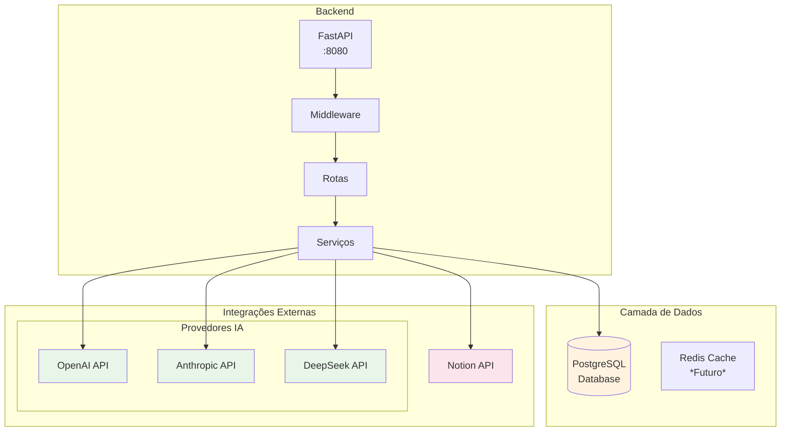
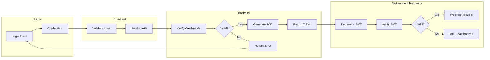
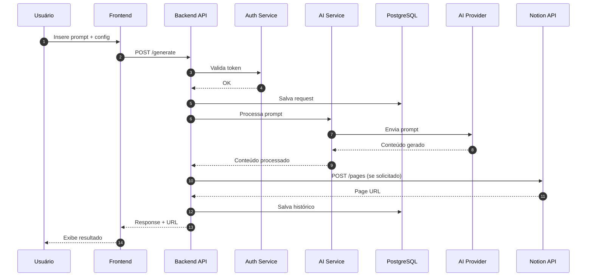
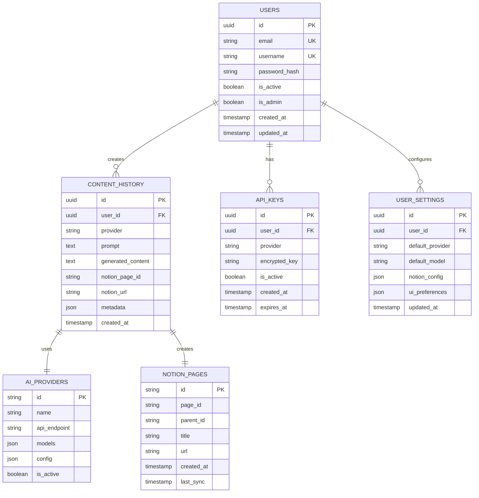
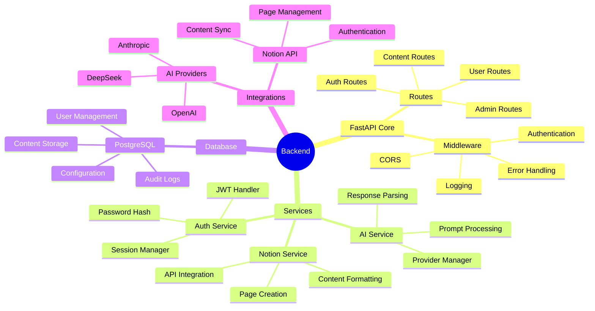
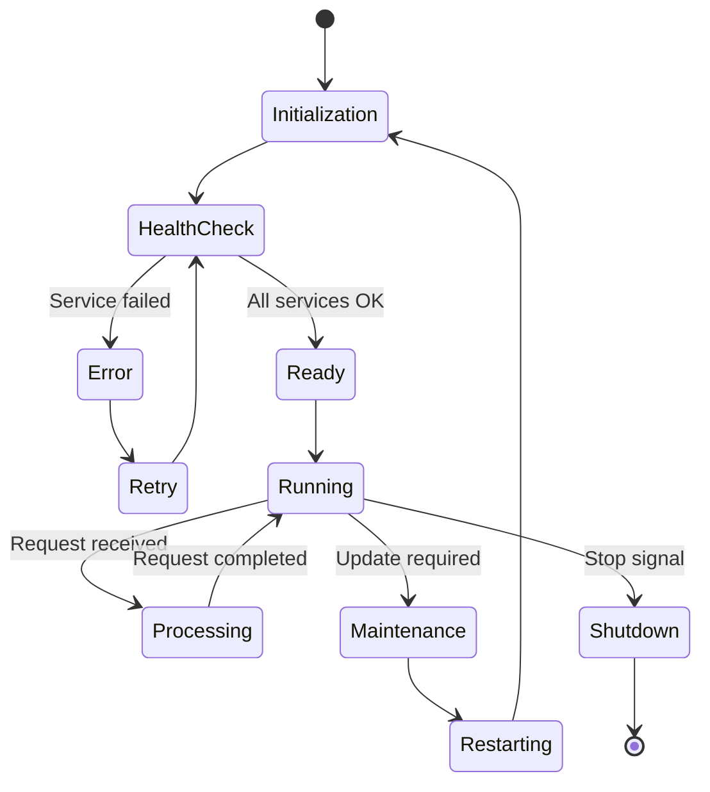
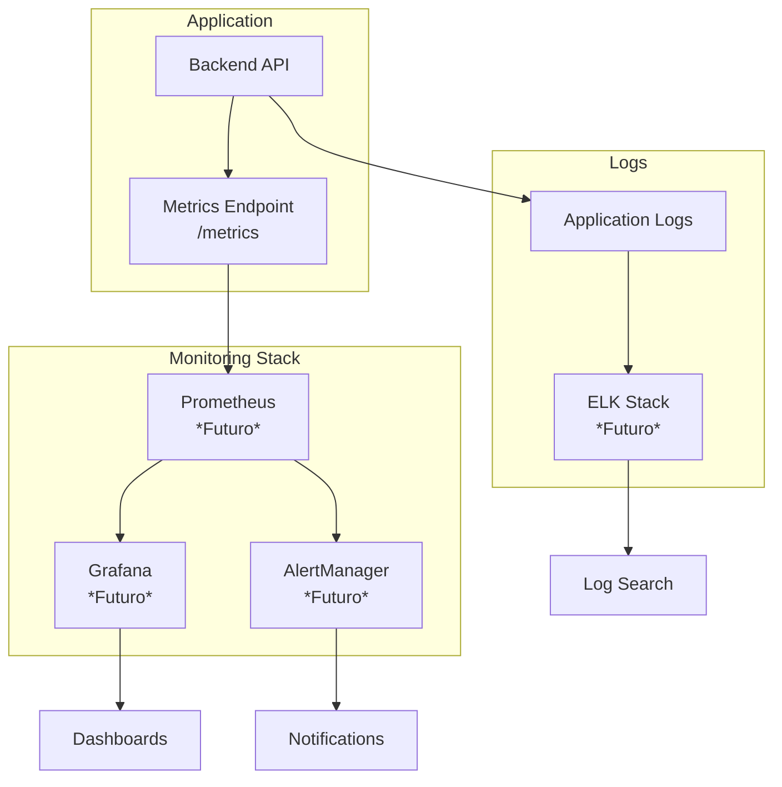

# Arquitetura Backend -  Notion Assistant

Este documento detalha a arquitetura do backend do  Notion Assistant, incluindo seus componentes, fluxos de dados e padrões de design.

## Visão Geral

O backend do  Notion Assistant é construído com FastAPI, oferecendo uma API RESTful que gerencia a comunicação entre a interface do usuário, o banco de dados PostgreSQL e as integrações externas.



## Arquitetura em Camadas

O backend segue uma arquitetura em camadas bem definida:

### 1. API Layer

Responsável por expor endpoints RESTful e gerenciar requisições HTTP.

```python
# Exemplo de definição de endpoint
@router.post("/generate", response_model=ContentResponse)
async def generate_content(
    request: ContentRequest,
    current_user: User = Depends(get_current_user),
    content_service: ContentService = Depends()
):
    """Gera conteúdo utilizando AI e opcionalmente salva no Notion."""
    result = await content_service.generate(
        prompt=request.prompt,
        provider=request.provider,
        notion_save=request.save_to_notion,
        user_id=current_user.id
    )
    return result
```

### 2. Middleware Layer

Gerencia aspectos transversais como autenticação, logging e tratamento de erros.

```python
# Exemplo de middleware de autenticação
@app.middleware("http")
async def authenticate(request: Request, call_next):
    if request.url.path.startswith("/api/auth"):
        return await call_next(request)
        
    token = request.headers.get("Authorization")
    if not token or not token.startswith("Bearer "):
        return JSONResponse(
            status_code=401,
            content={"detail": "Invalid authentication credentials"}
        )
        
    # Validar token e configurar contexto
    # ...
    
    return await call_next(request)
```

### 3. Service Layer

Implementa a lógica de negócio e coordena entre diferentes componentes.

```python
# Exemplo de serviço de conteúdo
class ContentService:
    def __init__(
        self,
        ai_provider: AIProvider = Depends(),
        notion_client: NotionClient = Depends(),
        content_repository: ContentRepository = Depends()
    ):
        self.ai_provider = ai_provider
        self.notion_client = notion_client
        self.content_repository = content_repository
        
    async def generate(
        self, 
        prompt: str, 
        provider: str,
        notion_save: bool,
        user_id: str
    ) -> ContentResponse:
        # Gerar conteúdo com IA
        generated_content = await self.ai_provider.generate(prompt, provider)
        
        # Salvar no histórico
        history_id = await self.content_repository.save_history(
            user_id=user_id,
            prompt=prompt,
            generated_content=generated_content,
            provider=provider
        )
        
        # Salvar no Notion se solicitado
        notion_url = None
        if notion_save:
            result = await self.notion_client.create_page(
                user_id=user_id,
                content=generated_content,
                title=prompt[:50]
            )
            notion_url = result.get("url")
            
            # Atualizar histórico com URL do Notion
            await self.content_repository.update_history(
                history_id=history_id,
                notion_url=notion_url
            )
            
        return ContentResponse(
            content=generated_content,
            notion_url=notion_url
        )
```

### 4. Repository Layer

Abstrai o acesso ao banco de dados e operações de persistência.

```python
# Exemplo de repositório
class ContentRepository:
    def __init__(self, db: Database = Depends(get_db)):
        self.db = db
        
    async def save_history(
        self,
        user_id: str,
        prompt: str,
        generated_content: str,
        provider: str
    ) -> str:
        """Salva o histórico de geração de conteúdo."""
        history_id = str(uuid.uuid4())
        query = """
            INSERT INTO content_history
            (id, user_id, prompt, generated_content, provider, created_at)
            VALUES ($1, $2, $3, $4, $5, $6)
            RETURNING id
        """
        await self.db.execute(
            query,
            history_id,
            user_id,
            prompt,
            generated_content,
            provider,
            datetime.now()
        )
        return history_id
        
    async def update_history(
        self,
        history_id: str,
        notion_url: str = None
    ):
        """Atualiza o histórico com informações do Notion."""
        query = """
            UPDATE content_history
            SET notion_url = $1
            WHERE id = $2
        """
        await self.db.execute(query, notion_url, history_id)
```

## Fluxo de Autenticação

O sistema utiliza JWT (JSON Web Tokens) para autenticação:



## Fluxo de Geração de Conteúdo



## Integração com APIs de IA

O backend suporta múltiplos provedores de IA, facilitando a integração com diferentes LLMs:

```python
# Exemplo da classe de provedor de IA
class AIProvider:
    def __init__(self, settings: Settings = Depends(get_settings)):
        self.settings = settings
        self.providers = {
            "openai": self._generate_openai,
            "anthropic": self._generate_anthropic,
            "deepseek": self._generate_deepseek
        }
        
    async def generate(self, prompt: str, provider: str = "openai") -> str:
        """Gera conteúdo usando o provedor especificado."""
        if provider not in self.providers:
            raise ValueError(f"Unsupported provider: {provider}")
            
        generator = self.providers[provider]
        return await generator(prompt)
        
    async def _generate_openai(self, prompt: str) -> str:
        """Gera conteúdo usando OpenAI."""
        client = OpenAI(api_key=self.settings.openai_api_key)
        
        response = await client.chat.completions.create(
            model="gpt-4",
            messages=[
                {"role": "system", "content": "You are a helpful assistant."},
                {"role": "user", "content": prompt}
            ],
            temperature=0.7,
            max_tokens=2000
        )
        
        return response.choices[0].message.content
        
    async def _generate_anthropic(self, prompt: str) -> str:
        """Gera conteúdo usando Anthropic Claude."""
        client = anthropic.Client(api_key=self.settings.anthropic_api_key)
        
        response = client.completions.create(
            model="claude-2",
            prompt=f"\n\nHuman: {prompt}\n\nAssistant:",
            max_tokens_to_sample=2000,
            temperature=0.7
        )
        
        return response.completion
        
    async def _generate_deepseek(self, prompt: str) -> str:
        """Gera conteúdo usando DeepSeek."""
        # Implementação da integração com DeepSeek
        # ...
```

## Integração com Notion

O backend se integra com a API do Notion para criar e gerenciar páginas:

```python
# Exemplo da classe de cliente Notion
class NotionClient:
    def __init__(self, settings: Settings = Depends(get_settings)):
        self.settings = settings
        
    async def create_page(
        self,
        user_id: str,
        content: str,
        title: str
    ) -> dict:
        """Cria uma nova página no Notion."""
        # Obter token do usuário
        token = await self._get_user_notion_token(user_id)
        
        # Inicializar cliente Notion
        notion = Client(auth=token)
        
        # Preparar conteúdo
        blocks = self._content_to_blocks(content)
        
        # Criar página
        response = notion.pages.create(
            parent={"database_id": self.settings.notion_database_id},
            properties={
                "Name": {
                    "title": [
                        {
                            "text": {
                                "content": title
                            }
                        }
                    ]
                },
                "Created by": {
                    "rich_text": [
                        {
                            "text": {
                                "content": " Assistant"
                            }
                        }
                    ]
                }
            },
            children=blocks
        )
        
        return {
            "id": response["id"],
            "url": response["url"]
        }
        
    def _content_to_blocks(self, content: str) -> list:
        """Converte texto em blocos do Notion."""
        # Implementação da conversão de texto para blocos do Notion
        # ...
        
    async def _get_user_notion_token(self, user_id: str) -> str:
        """Obtém o token do Notion do usuário."""
        # Implementação para buscar o token do usuário no banco de dados
        # ...
```

## Modelo de Dados

O backend utiliza o seguinte modelo de dados:



## Gestão de Dependências

O backend utiliza injeção de dependências para facilitar testes e manutenção:

```python
# app/dependencies.py
from fastapi import Depends
from databases import Database

from app.core.config import Settings, get_settings
from app.core.security import oauth2_scheme, verify_token
from app.db.database import get_database
from app.repositories.user_repository import UserRepository

async def get_current_user(
    token: str = Depends(oauth2_scheme),
    settings: Settings = Depends(get_settings),
    db: Database = Depends(get_database)
):
    """Obtém o usuário atual a partir do token JWT."""
    payload = verify_token(token, settings.jwt_secret)
    user_id = payload.get("sub")
    
    user_repo = UserRepository(db)
    user = await user_repo.get_by_id(user_id)
    
    if not user:
        raise HTTPException(
            status_code=401,
            detail="User not found or inactive"
        )
        
    return user
```

## Tratamento de Erros

O backend implementa um sistema de tratamento de erros consistente:

```python
# app/core/exceptions.py
from fastapi import Request
from fastapi.responses import JSONResponse
from fastapi.exception_handlers import http_exception_handler
from starlette.exceptions import HTTPException as StarletteHTTPException

class AppException(Exception):
    def __init__(self, status_code: int, detail: str):
        self.status_code = status_code
        self.detail = detail

async def app_exception_handler(request: Request, exc: AppException):
    """Handler para exceções da aplicação."""
    return JSONResponse(
        status_code=exc.status_code,
        content={"detail": exc.detail}
    )

async def http_exception_handler(request: Request, exc: StarletteHTTPException):
    """Handler para exceções HTTP."""
    return await http_exception_handler(request, exc)

def configure_exception_handlers(app):
    """Configura os handlers de exceções."""
    app.add_exception_handler(AppException, app_exception_handler)
    app.add_exception_handler(StarletteHTTPException, http_exception_handler)
    
    # Handler global para exceções não tratadas
    @app.exception_handler(Exception)
    async def global_exception_handler(request: Request, exc: Exception):
        # Log da exceção
        logger.error(f"Unhandled exception: {str(exc)}", exc_info=True)
        
        return JSONResponse(
            status_code=500,
            content={"detail": "Internal server error"}
        )
```

## Considerações de Performance

O backend utiliza várias técnicas para garantir boa performance:

1. **Operações Assíncronas**: Uso de `async/await` para operações I/O-bound
2. **Conexões Persistentes**: Pool de conexões com o banco de dados
3. **Cache**: Implementação planejada de cache Redis para respostas frequentes
4. **Optimização de Consultas**: Índices e queries eficientes

## Testes

O backend inclui testes automatizados:

```python
# Exemplo de teste de unidade
def test_content_service():
    # Mocks
    ai_provider_mock = Mock()
    ai_provider_mock.generate.return_value = "Generated content"
    
    notion_client_mock = Mock()
    notion_client_mock.create_page.return_value = {"url": "https://notion.so/page"}
    
    content_repo_mock = Mock()
    content_repo_mock.save_history.return_value = "history_id"
    
    # Serviço
    service = ContentService(
        ai_provider=ai_provider_mock,
        notion_client=notion_client_mock,
        content_repository=content_repo_mock
    )
    
    # Test
    result = service.generate(
        prompt="Test prompt",
        provider="openai",
        notion_save=True,
        user_id="user123"
    )
    
    # Assertions
    assert result.content == "Generated content"
    assert result.notion_url == "https://notion.so/page"
    ai_provider_mock.generate.assert_called_once_with("Test prompt", "openai")
    content_repo_mock.save_history.assert_called_once()
    notion_client_mock.create_page.assert_called_once()
```

## Segurança

O backend implementa várias medidas de segurança:

1. **Autenticação**: JWT com rotação regular de secrets
2. **Autorização**: Controle de acesso baseado em papéis
3. **Validação de Entrada**: Schemas Pydantic para validar todas as entradas
4. **Proteção contra Ataques Comuns**: CORS, rate limiting, etc.
5. **Armazenamento Seguro**: Senhas com hash, secrets criptografados

## Componentes e Responsabilidades



## Ciclo de Vida da Aplicação



## Métricas e Monitoramento



## Próximos Passos

1. **Cache**: Implementação de Redis para cache de respostas frequentes
2. **Escalabilidade**: Preparação para multiple instances
3. **Métricas**: Implementação de sistema de monitoramento mais robusto
4. **Integração com Outros Serviços**: Expandir para além do Notion