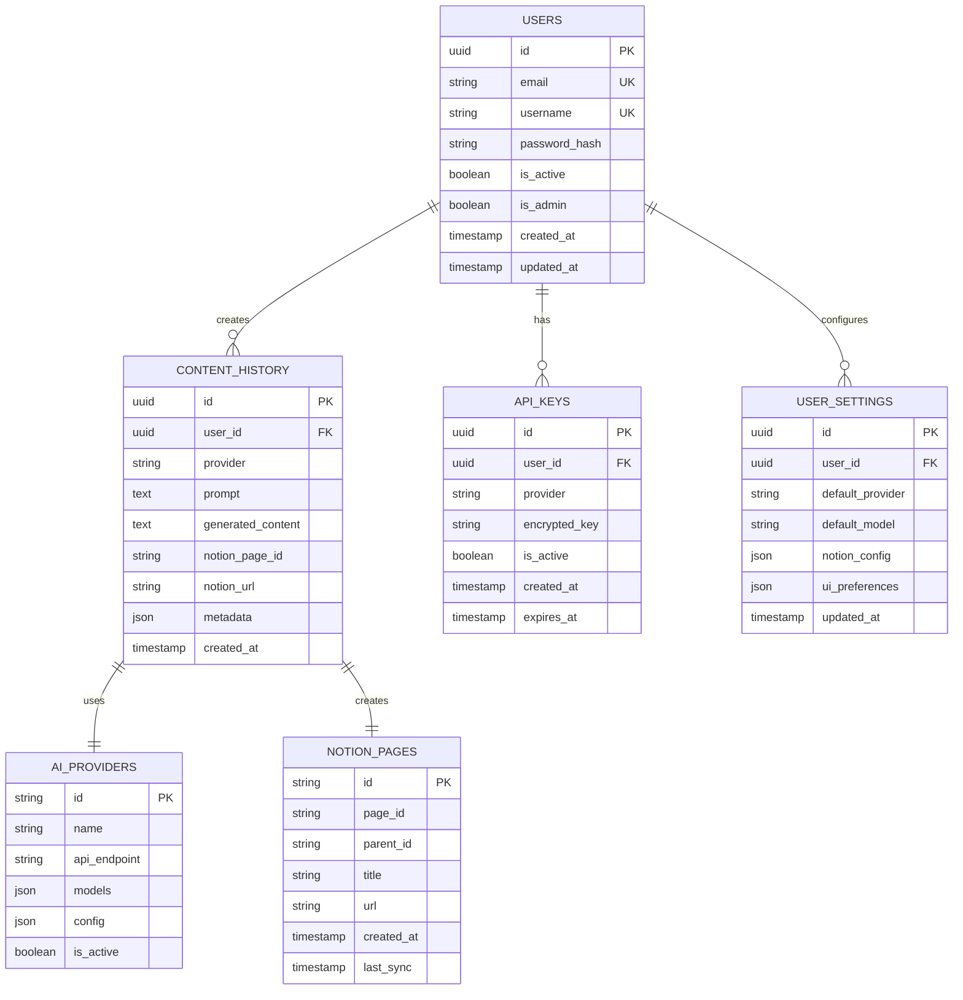

# Banco de Dados -  Notion Assistant

Este documento detalha a estrutura, configuração e melhores práticas do banco de dados PostgreSQL utilizado no  Notion Assistant.

## Visão Geral

O  Notion Assistant utiliza PostgreSQL como banco de dados relacional para armazenar dados de usuários, histórico de interações, configurações e integrações.



## Estrutura do Banco de Dados

### Tabelas Principais

#### 1. Usuários (`users`)

Armazena informações dos usuários da aplicação.

```sql
CREATE TABLE users (
    id UUID PRIMARY KEY DEFAULT gen_random_uuid(),
    username VARCHAR(50) NOT NULL UNIQUE,
    email VARCHAR(255) NOT NULL UNIQUE,
    password_hash VARCHAR(255) NOT NULL,
    is_active BOOLEAN NOT NULL DEFAULT TRUE,
    is_admin BOOLEAN NOT NULL DEFAULT FALSE,
    created_at TIMESTAMP WITH TIME ZONE NOT NULL DEFAULT NOW(),
    updated_at TIMESTAMP WITH TIME ZONE NOT NULL DEFAULT NOW()
);

CREATE INDEX idx_users_email ON users(email);
CREATE INDEX idx_users_username ON users(username);
```

#### 2. Histórico de Conteúdo (`content_history`)

Armazena histórico de interações e conteúdo gerado.

```sql
CREATE TABLE content_history (
    id UUID PRIMARY KEY DEFAULT gen_random_uuid(),
    user_id UUID NOT NULL REFERENCES users(id) ON DELETE CASCADE,
    provider VARCHAR(50) NOT NULL,
    prompt TEXT NOT NULL,
    generated_content TEXT NOT NULL,
    notion_page_id VARCHAR(255),
    notion_url VARCHAR(255),
    metadata JSONB,
    created_at TIMESTAMP WITH TIME ZONE NOT NULL DEFAULT NOW()
);

CREATE INDEX idx_content_history_user_id ON content_history(user_id);
CREATE INDEX idx_content_history_created_at ON content_history(created_at);
CREATE INDEX idx_content_history_provider ON content_history(provider);
```

#### 3. Chaves de API (`api_keys`)

Armazena chaves de API de forma segura para integração com serviços externos.

```sql
CREATE TABLE api_keys (
    id UUID PRIMARY KEY DEFAULT gen_random_uuid(),
    user_id UUID NOT NULL REFERENCES users(id) ON DELETE CASCADE,
    provider VARCHAR(50) NOT NULL,
    encrypted_key TEXT NOT NULL,
    is_active BOOLEAN NOT NULL DEFAULT TRUE,
    created_at TIMESTAMP WITH TIME ZONE NOT NULL DEFAULT NOW(),
    expires_at TIMESTAMP WITH TIME ZONE
);

CREATE INDEX idx_api_keys_user_id ON api_keys(user_id);
CREATE INDEX idx_api_keys_provider ON api_keys(provider);
```

#### 4. Provedores de IA (`ai_providers`)

Informações sobre os provedores de IA disponíveis.

```sql
CREATE TABLE ai_providers (
    id VARCHAR(50) PRIMARY KEY,
    name VARCHAR(100) NOT NULL,
    api_endpoint VARCHAR(255),
    models JSONB DEFAULT '[]'::jsonb,
    config JSONB DEFAULT '{}'::jsonb,
    is_active BOOLEAN NOT NULL DEFAULT TRUE
);
```

#### 5. Páginas do Notion (`notion_pages`)

Metadados sobre páginas criadas no Notion.

```sql
CREATE TABLE notion_pages (
    id UUID PRIMARY KEY DEFAULT gen_random_uuid(),
    page_id VARCHAR(255) NOT NULL UNIQUE,
    parent_id VARCHAR(255),
    title VARCHAR(255) NOT NULL,
    url VARCHAR(255) NOT NULL,
    created_at TIMESTAMP WITH TIME ZONE NOT NULL DEFAULT NOW(),
    last_sync TIMESTAMP WITH TIME ZONE
);

CREATE INDEX idx_notion_pages_page_id ON notion_pages(page_id);
```

#### 6. Configurações de Usuário (`user_settings`)

Preferências e configurações específicas para cada usuário.

```sql
CREATE TABLE user_settings (
    id UUID PRIMARY KEY DEFAULT gen_random_uuid(),
    user_id UUID NOT NULL REFERENCES users(id) ON DELETE CASCADE UNIQUE,
    default_provider VARCHAR(50),
    default_model VARCHAR(50),
    notion_config JSONB DEFAULT '{}'::jsonb,
    ui_preferences JSONB DEFAULT '{}'::jsonb,
    updated_at TIMESTAMP WITH TIME ZONE NOT NULL DEFAULT NOW()
);

CREATE INDEX idx_user_settings_user_id ON user_settings(user_id);
```

## Migrações de Banco de Dados

O  Notion Assistant utiliza Alembic para gerenciar migrações de banco de dados.

### Estrutura de Migrações

```
migrations/
├── env.py           # Configuração do ambiente de migração
├── README.md        # Documentação sobre migrações
├── script.py.mako   # Template para scripts de migração
└── versions/        # Scripts de migração versionados
    ├── 001_initial_schema.py
    ├── 002_add_metadata_column.py
    └── 003_create_user_settings.py
```

### Exemplo de Script de Migração

```python
# migrations/versions/001_initial_schema.py
"""Initial schema

Revision ID: 001
Revises: 
Create Date: 2025-05-01 10:00:00.000000

"""
from alembic import op
import sqlalchemy as sa
from sqlalchemy.dialects.postgresql import UUID, JSONB

# revision identifiers
revision = '001'
down_revision = None
branch_labels = None
depends_on = None

def upgrade():
    # Criar tabela de usuários
    op.create_table(
        'users',
        sa.Column('id', UUID, primary_key=True, server_default=sa.text("gen_random_uuid()")),
        sa.Column('username', sa.String(50), nullable=False, unique=True),
        sa.Column('email', sa.String(255), nullable=False, unique=True),
        sa.Column('password_hash', sa.String(255), nullable=False),
        sa.Column('is_active', sa.Boolean, nullable=False, default=True),
        sa.Column('is_admin', sa.Boolean, nullable=False, default=False),
        sa.Column('created_at', sa.TIMESTAMP(timezone=True), nullable=False, server_default=sa.text("NOW()")),
        sa.Column('updated_at', sa.TIMESTAMP(timezone=True), nullable=False, server_default=sa.text("NOW()"))
    )
    
    # Criar índices
    op.create_index('idx_users_email', 'users', ['email'])
    op.create_index('idx_users_username', 'users', ['username'])
    
    # ... código para criar outras tabelas
    
def downgrade():
    # Remover tabelas na ordem inversa
    op.drop_table('user_settings')
    op.drop_table('notion_pages')
    op.drop_table('api_keys')
    op.drop_table('content_history')
    op.drop_table('ai_providers')
    op.drop_table('users')
```

### Comandos de Migração

```bash
# Gerar nova migração
alembic revision -m "descrição_da_migração"

# Aplicar migrações pendentes
alembic upgrade head

# Reverter última migração
alembic downgrade -1

# Verificar status atual
alembic current
```

## Configuração do PostgreSQL

### Configuração para Desenvolvimento

Otimizado para desenvolvimento local:

```
# postgresql.conf - Desenvolvimento
listen_addresses = '*'
max_connections = 100

# Memória
shared_buffers = 128MB
work_mem = 4MB
maintenance_work_mem = 32MB

# Logging para depuração
log_min_duration_statement = 0
log_statement = 'all'
log_line_prefix = '%t [%p]: [%l-1] user=%u,db=%d,app=%a,client=%h '
log_duration = on

# Performance
synchronous_commit = off
```

### Configuração para Produção

Otimizado para performance e segurança em produção:

```
# postgresql.conf - Produção
listen_addresses = 'localhost'
max_connections = 100

# Memória (ajustado para recursos disponíveis na VPS)
shared_buffers = 1GB
work_mem = 16MB
maintenance_work_mem = 128MB
effective_cache_size = 3GB
random_page_cost = 1.1

# Logging mínimo em produção
log_min_duration_statement = 200
log_statement = 'none'
log_duration = off
log_min_error_statement = 'error'
log_line_prefix = '%t [%p]: [%l-1] user=%u,db=%d,app=%a,client=%h '

# WAL e Durabilidade
wal_level = replica
archive_mode = on
archive_command = 'test ! -f /path/to/archive/%f && cp %p /path/to/archive/%f'
archive_timeout = 60

# Performance
synchronous_commit = on
checkpoint_timeout = 5min
max_wal_size = 1GB
min_wal_size = 80MB
```

### Configuração de Acesso (pg_hba.conf)

```
# Desenvolvimento
local   all             postgres                                peer
host    all             all             127.0.0.1/32            md5
host    all             all             ::1/128                 md5
host    all             all             172.19.0.0/16           md5

# Produção - mais restritivo
local   all             postgres                                peer
host    notionassistant notioniauser    127.0.0.1/32            md5
host    notionassistant notioniauser    172.19.0.0/16           md5
```

## Acesso ao Banco de Dados

### SQLAlchemy e Databases

O  Notion Assistant utiliza a biblioteca `databases` para acesso assíncrono ao PostgreSQL, junto com SQLAlchemy para definição de modelos.

```python
# app/db/database.py
import databases
from sqlalchemy import create_engine, MetaData
from app.core.config import settings

# URL de conexão
DATABASE_URL = settings.database_url

# Instância do banco de dados
database = databases.Database(DATABASE_URL)

# Engine SQLAlchemy para migrações
engine = create_engine(DATABASE_URL)
metadata = MetaData()

# Função para obter instância do banco de dados
async def get_db():
    return database
```

### Modelos SQLAlchemy

```python
# app/models/user.py
from sqlalchemy import Column, String, Boolean, DateTime, func, Table, ForeignKey
from sqlalchemy.dialects.postgresql import UUID
from uuid import uuid4
from app.db.database import metadata

users = Table(
    "users",
    metadata,
    Column("id", UUID(), primary_key=True, default=uuid4),
    Column("username", String(50), unique=True, nullable=False),
    Column("email", String(255), unique=True, nullable=False),
    Column("password_hash", String(255), nullable=False),
    Column("is_active", Boolean, default=True, nullable=False),
    Column("is_admin", Boolean, default=False, nullable=False),
    Column("created_at", DateTime(timezone=True), server_default=func.now(), nullable=False),
    Column("updated_at", DateTime(timezone=True), server_default=func.now(), onupdate=func.now(), nullable=False)
)

# Outros modelos seguem padrão similar
```

### Repositórios para Acesso

```python
# app/repositories/user_repository.py
from databases import Database
from app.models.user import users
from app.schemas.user import UserCreate, UserUpdate
from fastapi import Depends
from app.db.database import get_db

class UserRepository:
    def __init__(self, db: Database = Depends(get_db)):
        self.db = db
        
    async def create(self, user: UserCreate) -> str:
        """Cria um novo usuário."""
        query = users.insert().values(
            username=user.username,
            email=user.email,
            password_hash=user.password_hash
        )
        
        return await self.db.execute(query)
        
    async def get_by_email(self, email: str):
        """Busca usuário pelo email."""
        query = users.select().where(users.c.email == email)
        return await self.db.fetch_one(query)
        
    async def update(self, user_id: str, user: UserUpdate):
        """Atualiza dados do usuário."""
        query = users.update().where(
            users.c.id == user_id
        ).values(
            **user.dict(exclude_unset=True)
        )
        
        return await self.db.execute(query)
```

## Backups e Recuperação

### Sistema de Backup Automatizado

O  Notion Assistant implementa um sistema de backup automatizado para o banco de dados:

```bash
#!/bin/bash
# scripts/backup-database.sh

# Configurações
TIMESTAMP=$(date +%Y%m%d_%H%M%S)
BACKUP_DIR="/path/to/backups"
POSTGRES_CONTAINER="notionaissistant_postgres"
DB_NAME="notionassistant"
BACKUP_RETENTION=7  # dias

# Criar diretório de backup
mkdir -p $BACKUP_DIR

# Executar backup
echo "Starting database backup at $TIMESTAMP"
docker exec $POSTGRES_CONTAINER pg_dump -U postgres -d $DB_NAME -F c -f /tmp/backup_$TIMESTAMP.pg

# Copiar arquivo de backup do container
docker cp $POSTGRES_CONTAINER:/tmp/backup_$TIMESTAMP.pg $BACKUP_DIR/
docker exec $POSTGRES_CONTAINER rm /tmp/backup_$TIMESTAMP.pg

# Comprimir backup
gzip $BACKUP_DIR/backup_$TIMESTAMP.pg

# Remover backups antigos
find $BACKUP_DIR -name "backup_*.pg.gz" -type f -mtime +$BACKUP_RETENTION -delete

echo "Backup completed: $BACKUP_DIR/backup_$TIMESTAMP.pg.gz"
```

### Procedimento de Restauração

```bash
#!/bin/bash
# scripts/restore-database.sh

if [ -z "$1" ]; then
    echo "Usage: $0 <backup_file>"
    exit 1
fi

BACKUP_FILE=$1
POSTGRES_CONTAINER="notionaissistant_postgres"
DB_NAME="notionassistant"

# Verificar se o arquivo existe
if [ ! -f "$BACKUP_FILE" ]; then
    echo "Error: Backup file not found: $BACKUP_FILE"
    exit 1
fi

# Descomprimir se necessário
if [[ "$BACKUP_FILE" == *.gz ]]; then
    echo "Decompressing backup file..."
    gunzip -c "$BACKUP_FILE" > /tmp/backup_restore.pg
    BACKUP_FILE="/tmp/backup_restore.pg"
fi

# Copiar para o container
echo "Copying backup file to container..."
docker cp "$BACKUP_FILE" $POSTGRES_CONTAINER:/tmp/backup_restore.pg

# Restaurar banco de dados
echo "Restoring database from backup..."
docker exec $POSTGRES_CONTAINER psql -U postgres -c "DROP DATABASE IF EXISTS ${DB_NAME}_old;"
docker exec $POSTGRES_CONTAINER psql -U postgres -c "ALTER DATABASE $DB_NAME RENAME TO ${DB_NAME}_old;"
docker exec $POSTGRES_CONTAINER psql -U postgres -c "CREATE DATABASE $DB_NAME;"
docker exec $POSTGRES_CONTAINER pg_restore -U postgres -d $DB_NAME /tmp/backup_restore.pg

# Verificar restauração
RESTORE_STATUS=$?
if [ $RESTORE_STATUS -eq 0 ]; then
    echo "Database restored successfully!"
    docker exec $POSTGRES_CONTAINER psql -U postgres -c "DROP DATABASE ${DB_NAME}_old;"
else
    echo "Error restoring database, status code: $RESTORE_STATUS"
    echo "Rolling back to original database..."
    docker exec $POSTGRES_CONTAINER psql -U postgres -c "DROP DATABASE $DB_NAME;"
    docker exec $POSTGRES_CONTAINER psql -U postgres -c "ALTER DATABASE ${DB_NAME}_old RENAME TO $DB_NAME;"
fi

# Limpar arquivos temporários
docker exec $POSTGRES_CONTAINER rm /tmp/backup_restore.pg
if [[ "$BACKUP_FILE" == "/tmp/backup_restore.pg" ]]; then
    rm /tmp/backup_restore.pg
fi

echo "Restore process completed"
```

## Monitoramento do Banco de Dados

### Queries para Monitoramento

```sql
-- Estatísticas gerais
SELECT * FROM pg_stat_database WHERE datname = 'notionassistant';

-- Queries longas em execução
SELECT pid, now() - pg_stat_activity.query_start AS duration, query 
FROM pg_stat_activity 
WHERE query != '<IDLE>' AND query NOT ILIKE '%pg_stat_activity%' 
ORDER BY duration DESC;

-- Uso de índices
SELECT 
    schemaname, 
    relname, 
    indexrelname, 
    idx_scan, 
    idx_tup_read, 
    idx_tup_fetch
FROM 
    pg_stat_user_indexes
JOIN 
    pg_stat_user_tables 
ON 
    pg_stat_user_indexes.relname = pg_stat_user_tables.relname
ORDER BY 
    idx_scan DESC;

-- Tamanho das tabelas
SELECT 
    table_name, 
    pg_size_pretty(pg_total_relation_size(quote_ident(table_name))) as total_size
FROM 
    information_schema.tables
WHERE 
    table_schema = 'public'
ORDER BY 
    pg_total_relation_size(quote_ident(table_name)) DESC;
```

### Métricas para Alertas

```yaml
# Alertas do banco de dados
alerts:
  high_connection_count:
    query: "SELECT count(*) FROM pg_stat_activity"
    threshold: 80
    interval: "5m"
    
  long_running_queries:
    query: "SELECT count(*) FROM pg_stat_activity WHERE state = 'active' AND now() - query_start > interval '5 minutes'"
    threshold: 5
    interval: "1m"
    
  high_disk_usage:
    query: "SELECT pg_database_size(current_database())/1024/1024 as size_mb"
    threshold: 5000  # 5GB
    interval: "1h"
    
  transaction_id_wraparound:
    query: "SELECT max_age FROM pg_stat_database WHERE datname = 'notionassistant'"
    threshold: 1500000000  # ~75% do limite
    interval: "1d"
```

## Segurança do Banco de Dados

### Criptografia de Dados Sensíveis

```python
# app/core/security.py
from cryptography.fernet import Fernet
from app.core.config import settings

# Chave de criptografia
encryption_key = settings.encryption_key
fernet = Fernet(encryption_key)

def encrypt_data(data: str) -> str:
    """Criptografa dados sensíveis."""
    if not data:
        return data
    return fernet.encrypt(data.encode()).decode()

def decrypt_data(encrypted_data: str) -> str:
    """Descriptografa dados sensíveis."""
    if not encrypted_data:
        return encrypted_data
    return fernet.decrypt(encrypted_data.encode()).decode()
```

### Função para Hash de Senha

```python
# app/core/security.py
import bcrypt

def get_password_hash(password: str) -> str:
    """Gera hash de senha."""
    return bcrypt.hashpw(password.encode(), bcrypt.gensalt()).decode()

def verify_password(plain_password: str, hashed_password: str) -> bool:
    """Verifica se a senha está correta."""
    return bcrypt.checkpw(
        plain_password.encode(),
        hashed_password.encode()
    )
```

### Controle de Acesso ao Banco

```sql
-- Criar roles com permissões limitadas
CREATE ROLE notioniauser WITH LOGIN PASSWORD 'secure_password';
GRANT CONNECT ON DATABASE notionassistant TO notioniauser;
GRANT USAGE ON SCHEMA public TO notioniauser;

-- Conceder permissões específicas por tabela
GRANT SELECT, INSERT, UPDATE, DELETE ON users TO notioniauser;
GRANT SELECT, INSERT, UPDATE, DELETE ON content_history TO notioniauser;
GRANT SELECT, INSERT, UPDATE, DELETE ON api_keys TO notioniauser;
GRANT SELECT, INSERT, UPDATE, DELETE ON notion_pages TO notioniauser;
GRANT SELECT, INSERT, UPDATE, DELETE ON user_settings TO notioniauser;

-- Somente leitura para tabelas de referência
GRANT SELECT ON ai_providers TO notioniauser;

-- Garantir acesso às sequências
GRANT USAGE, SELECT ON ALL SEQUENCES IN SCHEMA public TO notioniauser;
```

## Índices e Otimização

### Índices Principais

```sql
-- Índices para melhorar performance de queries comuns

-- Busca por usuários
CREATE INDEX idx_users_email ON users(email);
CREATE INDEX idx_users_username ON users(username);

-- Busca de histórico
CREATE INDEX idx_content_history_user_id ON content_history(user_id);
CREATE INDEX idx_content_history_created_at ON content_history(created_at);
CREATE INDEX idx_content_history_provider ON content_history(provider);

-- Índice de texto para busca de conteúdo
CREATE INDEX idx_content_history_prompt_tsvector 
ON content_history 
USING gin(to_tsvector('portuguese', prompt));

CREATE INDEX idx_content_history_content_tsvector 
ON content_history 
USING gin(to_tsvector('portuguese', generated_content));

-- Índices para chaves de API
CREATE INDEX idx_api_keys_user_id ON api_keys(user_id);
CREATE INDEX idx_api_keys_provider ON api_keys(provider);

-- Índices para páginas Notion
CREATE INDEX idx_notion_pages_page_id ON notion_pages(page_id);
```

### Análise de Queries Lentas

```sql
-- Habilitar log de queries lentas
ALTER SYSTEM SET log_min_duration_statement = 200;
SELECT pg_reload_conf();

-- Visualizar queries lentas
SELECT 
    substring(query, 1, 50) as short_query,
    round(total_exec_time::numeric, 2) as total_exec_time_ms,
    calls,
    round(mean_exec_time::numeric, 2) as mean_exec_time_ms,
    round(stddev_exec_time::numeric, 2) as stddev_exec_time_ms,
    rows,
    100.0 * shared_blks_hit / nullif(shared_blks_hit + shared_blks_read, 0) AS hit_percent
FROM pg_stat_statements
ORDER BY total_exec_time DESC
LIMIT 10;
```

### Otimização de Queries Específicas

```sql
-- Exemplo de query otimizada para histórico de usuário
EXPLAIN ANALYZE
WITH ranked_history AS (
    SELECT 
        ch.*,
        ROW_NUMBER() OVER (PARTITION BY DATE(ch.created_at) ORDER BY ch.created_at DESC) as rn
    FROM 
        content_history ch
    WHERE 
        ch.user_id = '00000000-0000-0000-0000-000000000000'
        AND ch.created_at >= CURRENT_DATE - INTERVAL '30 days'
)
SELECT * FROM ranked_history
WHERE rn <= 3
ORDER BY created_at DESC;
```

## Gestão de Migrations e Schema

### Estrutura de Versionamento

```
migrations/
├── versions/
│   ├── 001_initial_schema.py       # Esquema inicial
│   ├── 002_add_metadata_column.py  # Adiciona coluna de metadados
│   ├── 003_add_indexes.py          # Adiciona índices para performance
│   └── 004_user_settings.py        # Adiciona tabela de configurações
```

### Estratégia de Evolução do Schema

1. **Zero Downtime**: Migrações são projetadas para não exigir downtime
2. **Compatibilidade Retroativa**: Manter compatibilidade com versões anteriores
3. **Reversibilidade**: Toda migração tem função de downgrade
4. **Transacionalidade**: Migrações são executadas dentro de transações

## Próximos Passos

1. **Particionamento**: Implementar particionamento para tabelas que crescem rapidamente
2. **Cache**: Adicionar Redis para caching de dados frequentemente acessados
3. **Replicação**: Configurar réplica para leitura para alta disponibilidade
4. **Indexação Avançada**: Implementar índices parciais e de expressão para casos específicos
5. **Arquivamento**: Sistema automatizado para arquivar dados históricos