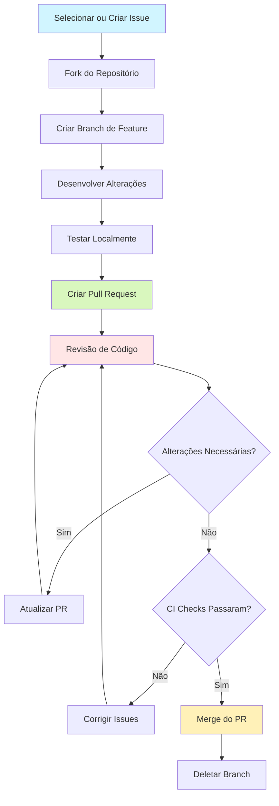
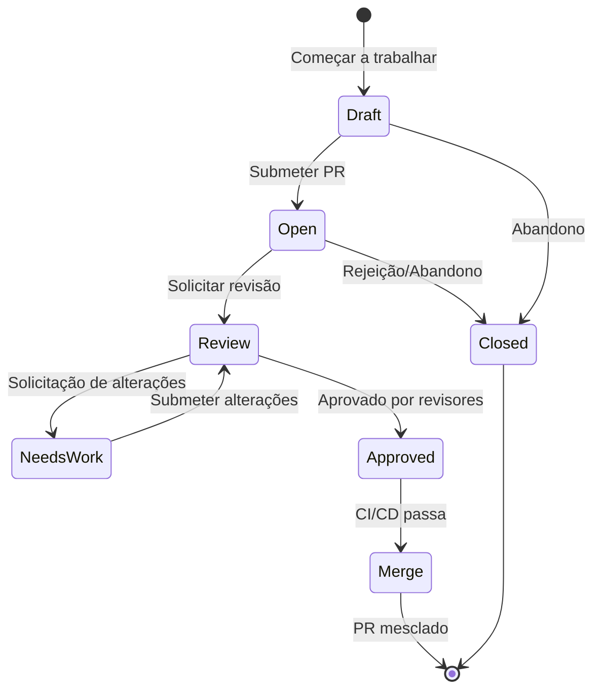
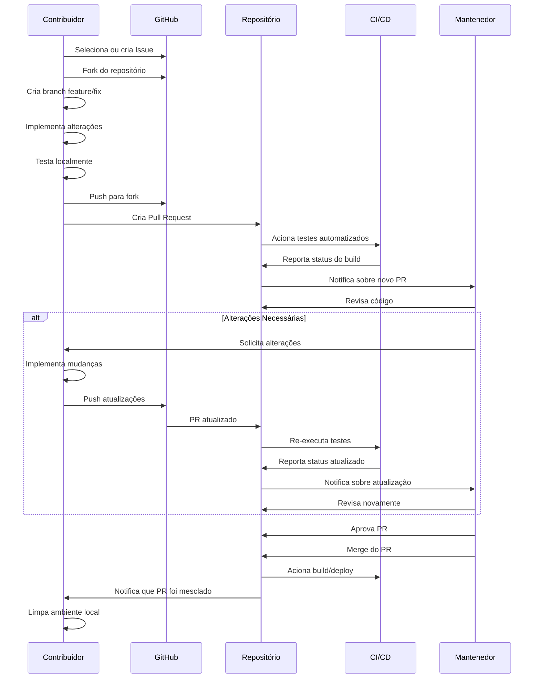

# Fluxo de Pull Request -  Notion Assistant

Este documento detalha o processo de contribuição via Pull Requests (PRs) para o projeto  Notion Assistant, desde a preparação inicial até a revisão e merge.

## Visão Geral do Fluxo



## 1. Preparação

### 1.1 Selecionar ou Criar uma Issue

Antes de iniciar qualquer trabalho:

1. Verifique as [issues existentes](https://github.com/igorhlr/NotionAiAssistant/issues) para ver se a alteração que você deseja fazer já foi discutida
2. Procure por issues marcadas como `good first issue` se for sua primeira contribuição
3. Se necessário, crie uma nova issue descrevendo o problema ou melhoria

```bash
# Exemplo de pesquisa de issues por tags
gh issue list --label "good first issue"
# ou
gh issue list --label "bug"
```

### 1.2 Fork do Repositório

Crie um fork do repositório para sua conta:

1. Acesse a [página do repositório](https://github.com/igorhlr/NotionAiAssistant)
2. Clique no botão "Fork" no canto superior direito
3. Clone seu fork localmente:

```bash
git clone https://github.com/seu-username/NotionAiAssistant.git
cd NotionAiAssistant

# Adicionar o repositório original como remote
git remote add upstream https://github.com/igorhlr/NotionAiAssistant.git
```

### 1.3 Criar Branch de Feature

Crie uma branch específica para sua contribuição:

```bash
# Atualizar sua branch main local
git checkout main
git pull upstream main

# Criar branch de feature
git checkout -b feature/nome-descritivo
# ou
git checkout -b fix/nome-do-bug
# ou
git checkout -b docs/nome-da-documentacao
```

Convenções de nomenclatura de branches:
- `feature/` - para novas funcionalidades
- `fix/` - para correções de bugs
- `docs/` - para melhorias na documentação
- `refactor/` - para refatoração de código
- `test/` - para adição ou melhoria de testes

## 2. Desenvolvimento

### 2.1 Implementar Alterações

Desenvolva sua contribuição seguindo os [Padrões de Código](./01-padroes-codigo.md) do projeto:

1. Escreva código limpo e bem documentado
2. Adicione testes para novas funcionalidades
3. Atualize a documentação conforme necessário

### 2.2 Commits Frequentes

Faça commits regulares e significativos:

```bash
# Adicionar arquivos específicos
git add caminho/para/arquivo.py

# Commitar com mensagem descritiva
git commit -m "feat: implementa geração de conteúdo com Claude API"
```

Seguimos o padrão [Conventional Commits](https://www.conventionalcommits.org/):
- `feat:` - nova funcionalidade
- `fix:` - correção de bug
- `docs:` - alterações na documentação
- `style:` - formatação, ponto e vírgula, etc; sem alteração de código
- `refactor:` - refatoração de código
- `test:` - adição ou correção de testes
- `chore:` - atualizações de tarefas de build, configurações, etc

### 2.3 Manter-se Atualizado

Regularmente sincronize sua branch com a branch principal do repositório upstream:

```bash
git fetch upstream
git rebase upstream/main
```

### 2.4 Testar Localmente

Antes de submeter seu PR, execute todos os testes para garantir que suas alterações não quebraram nada:

```bash
# Configurar ambiente
python -m venv venv
source venv/bin/activate  # Linux/Mac
# ou
venv\Scripts\activate  # Windows

pip install -r requirements-dev.txt

# Executar linting
black app/ tests/
flake8 app/ tests/
mypy app/

# Executar testes
pytest

# Executar testes com cobertura
pytest --cov=app --cov-report=term-missing
```

## 3. Submissão do Pull Request

### 3.1 Preparação Final

Antes de criar o PR:

1. Rebase sua branch com a branch principal mais recente:
   ```bash
   git fetch upstream
   git rebase upstream/main
   ```

2. Certifique-se de que todos os testes estão passando:
   ```bash
   pytest
   ```

3. Certifique-se de que as ferramentas de qualidade de código estão satisfeitas:
   ```bash
   black --check app/ tests/
   flake8 app/ tests/
   mypy app/
   ```

4. Atualize o CHANGELOG.md se aplicável

### 3.2 Criar o Pull Request

Envie suas alterações para seu fork e crie o PR:

```bash
# Enviar alterações para seu fork
git push origin feature/nome-descritivo

# Criar PR via linha de comando (opcional)
gh pr create --title "Titulo do PR" --body "Descrição detalhada"
```

Alternativamente, você pode criar o PR através da interface web do GitHub:
1. Vá para a [página do repositório original](https://github.com/igorhlr/NotionAiAssistant)
2. Clique em "Pull Requests" e depois em "New Pull Request"
3. Clique em "compare across forks"
4. Selecione seu fork e a branch que contém suas alterações

### 3.3 Modelo de Pull Request

Preencha o template de PR com informações detalhadas:

```markdown
## Descrição

[Descreva claramente o que foi alterado e por quê]

## Tipo de alteração

- [ ] 🐛 Correção de bug
- [ ] ✨ Nova funcionalidade
- [ ] 📚 Atualização de documentação
- [ ] 🧹 Refatoração/melhoria
- [ ] 🧪 Adição/atualização de testes
- [ ] 🔄 Atualização de dependências

## Issue relacionada

Fixes #[número da issue]

## Como testar

[Instruções passo a passo para testar as alterações]

## Checklist

- [ ] Meu código segue os padrões do projeto
- [ ] Adicionei testes que provam que minha correção/funcionalidade funciona
- [ ] Atualizei a documentação conforme necessário
- [ ] Todos os testes novos e existentes estão passando
```

### 3.4 Vincular à Issue

Vincule seu PR à issue que está resolvendo:
- No corpo do PR, inclua "Fixes #123" ou "Closes #123" (onde 123 é o número da issue)
- Isso vinculará automaticamente o PR à issue e fechará a issue quando o PR for mesclado

## 4. Revisão de Código

### 4.1 Processo de Revisão

Após a submissão do PR:

1. Os mantenedores do projeto serão notificados e revisarão o código
2. O CI/CD executará verificações automatizadas
3. Os revisores poderão deixar comentários, sugestões ou solicitar alterações

### 4.2 Respondendo a Comentários

Quando receber feedback:

1. Responda a todos os comentários de forma clara e educada
2. Faça as alterações solicitadas em novos commits
3. Empurre as alterações para a mesma branch:
   ```bash
   git add .
   git commit -m "fix: correção baseada no feedback do PR"
   git push origin feature/nome-descritivo
   ```
4. Quando finalizar as alterações, comente no PR informando que está pronto para revisão novamente

### 4.3 Resolver Conflitos

Se houver conflitos entre sua branch e a branch principal:

```bash
git fetch upstream
git rebase upstream/main

# Resolver conflitos manualmente
# Após resolver os conflitos:
git add .
git rebase --continue

# Forçar push para atualizar seu PR
git push origin feature/nome-descritivo --force-with-lease
```

## 5. Merge e Finalização

### 5.1 Requisitos para Merge

Um PR está pronto para merge quando:

1. Foi aprovado por pelo menos um mantenedor do projeto
2. Todas as verificações do CI estão passando
3. O código segue os padrões do projeto
4. A funcionalidade foi testada adequadamente

### 5.2 Processo de Merge

Normalmente, um mantenedor do projeto realizará o merge:

1. Squash e merge (preferido para PRs menores)
   - Consolida todos os commits em um único commit limpo
   - Mantém o histórico principal limpo

2. Rebase e merge (para PRs maiores com histórico significativo)
   - Preserva o histórico de commits da feature
   - Mantém um histórico linear

### 5.3 Após o Merge

Após o merge do PR:

1. A branch principal será atualizada automaticamente
2. A issue vinculada será fechada automaticamente (se configurada corretamente)
3. O CI/CD executará o processo de build e deploy
4. Sua contribuição fará parte da próxima release

### 5.4 Limpeza

Limpe seu ambiente local:

```bash
# Voltar para a branch principal
git checkout main

# Atualizar com as mudanças mais recentes
git pull upstream main

# Deletar a branch local
git branch -d feature/nome-descritivo

# Deletar a branch remota (opcional)
git push origin --delete feature/nome-descritivo
```

## 6. Ciclo de Vida do PR



## 7. Melhores Práticas

### 7.1 Tamanho do PR

- **Mantenha PRs pequenos e focados**: Um PR deve implementar uma única funcionalidade ou correção
- **Evite PRs gigantes**: PRs com mais de 500 linhas alteradas são difíceis de revisar
- Se sua alteração é grande, considere dividi-la em vários PRs menores

### 7.2 Comunicação

- **Seja claro e descritivo**: Explique bem o que e por que você está alterando
- **Responda prontamente**: Responda a comentários e solicitações de alteração assim que possível
- **Seja paciente**: Os mantenedores são frequentemente voluntários com tempo limitado

### 7.3 Testes

- **Teste tudo**: Adicione testes para novas funcionalidades e correções de bugs
- **Não diminua a cobertura**: Seu código deve manter ou melhorar a cobertura de testes
- **Pense em casos extremos**: Teste cenários de erro e casos limítrofes

### 7.4 Documentação

- **Atualize a documentação**: Certifique-se de que a documentação está atualizada com suas alterações
- **Docstrings**: Adicione docstrings para novas funções, classes e métodos
- **README/CHANGELOG**: Atualize se necessário

## 8. Ciclo de Contribuição Completo



## 9. FAQ

### 9.1 Como lidar com múltiplos commits em um PR?

Recomendamos manter um histórico de commits limpo. Antes de submeter seu PR, você pode consolidar seus commits:

```bash
# Interativamente rebase seus últimos N commits
git rebase -i HEAD~N

# No editor, mude 'pick' para 'squash' ou 's' para combinar commits
# Mantenha o primeiro commit como 'pick' e os demais como 'squash'
```

### 9.2 O que fazer se o CI falhar?

1. Clique no link de detalhes para ver o que falhou
2. Corrija os problemas localmente
3. Faça commit das alterações e push
4. O CI será executado novamente automaticamente

### 9.3 Quanto tempo leva para um PR ser revisado?

O tempo de revisão varia dependendo da complexidade do PR e da disponibilidade dos mantenedores. PRs menores e mais focados geralmente são revisados mais rapidamente.

### 9.4 Posso trabalhar em múltiplos PRs ao mesmo tempo?

Sim, mas recomendamos:
- Usar branches diferentes para cada PR
- Manter os PRs independentes para facilitar a revisão e o merge

## 10. Recursos Adicionais

- [Guia GitHub sobre PRs](https://docs.github.com/en/pull-requests)
- [Guia de Conventional Commits](https://www.conventionalcommits.org/)
- [Guia de Rebasing](https://git-scm.com/book/en/v2/Git-Branching-Rebasing)
- [Como escrever boas mensagens de commit](https://chris.beams.io/posts/git-commit/)

## Conclusão

Seguir este fluxo de PR garante uma experiência de contribuição tranquila e eficiente para todos os envolvidos. Agradecemos muito por contribuir com o  Notion Assistant e ajudar a torná-lo melhor para todos os usuários!